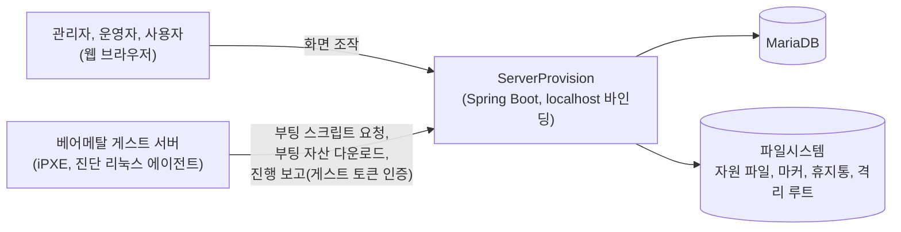
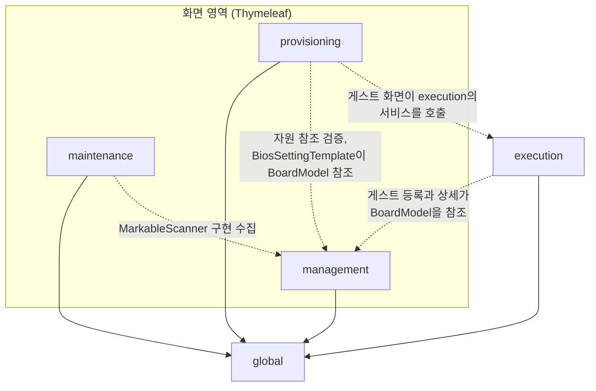

# ServerProvision 아키텍처

ServerProvision은 관리자가 등록한 자원(OS ISO, 펌웨어, 드라이버)과 사용자가 작성한 세팅 정의서를 입력으로 받아, 네트워크 부팅(PXE, Preboot eXecution Environment)으로 들어온 베어메탈 서버를 정의서대로 설치하고 설정한다. 사람은 Thymeleaf 서버 사이드 렌더링 화면으로 조작하고, 일부 화면은 비동기 요청(XHR, XMLHttpRequest)을 함께 쓴다.

게스트 서버와는 세 가지 HTTP 경로로 통신한다. 부팅 요청에는 iPXE 스크립트를 돌려준다. iPXE는 PXE를 구현한 오픈소스 부트 펌웨어로, 서버가 내려주는 스크립트를 그대로 실행한다. 진단 리눅스의 커널과 램디스크 같은 부팅 자산은 `/api/pxe/v1/assets/**` 경로로 내려받는다. 부팅이 끝나면 게스트 위의 에이전트가 JSON API로 진행을 보고한다.

자원 무결성 관리가 이 시스템의 두 번째 축이다. 모든 파일 자원은 디스크의 실물과 서명 마커 파일 `.provision.json`의 쌍으로 추적된다. 마커는 HMAC(Hash-based Message Authentication Code) 방식으로 서명된다. DB와 파일시스템이 어긋나면 재조정(reconciliation)이 이를 찾아내 해결한다. 파일이 어디에 있는가는 파일시스템이 기준이고, 자원이 어떤 수명주기 상태인가는 DB가 기준이다. 자세한 규칙은 아래 "파일시스템과 DB의 역할 분담"에서 설명한다.

로그인과 권한 계층은 없고 localhost 바인딩을 전제로 한다. 관리자, 운영자, 사용자라는 구분은 화면 영역의 구분이지 계정의 구분이 아니다.

## 처음 읽을 곳

코드를 처음 여는 사람은 다음 이름부터 찾아 읽으면 전체가 빠르게 잡힌다.

- 자원 도메인 공통 계약. `LifecycleService`는 모든 자원 도메인이 구현하는 수명주기 계약이다(toggleEnabled, softDelete, restore, deprecate, undeprecate, purge, purgeWithTypedNameCheck). `Markable`은 엔티티를 마커 체계에 연결하는 인터페이스, `MarkableScanner`는 도메인별 자원 목록을 재조정에 노출하는 확장점, `ResourceType`은 자원 종류와 마커 배치 방식을 정의하는 enum이다.
- 실행 계약. 프로비저닝이 무엇을 할지는 `SettingDefinition`과 `SettingProcess`에 저장된 단계 목록이 전부다.
- 게스트 진입점. `ExecutionRestController`가 부팅 요청을 받고, `BootService`와 `BootScriptDispatcher`가 응답할 스크립트를 판정한다. 에이전트 보고는 `GuestAgentRestController`가 받는다.
- 재조정 엔진. `PathReconciliationService`가 스캔을 총괄한다. 어긋남의 해결은 `DriftResolution`, 재점검은 `DriftRecheck` 구현이 종류별로 맡는다.
- 화면. `/management/*`, `/maintenance/*`, `/provisioning/*` 아래 각 기능의 `*Controller`가 진입점이고, URL의 첫 구간과 최상위 패키지가 일치한다. 예외는 global 패키지가 서빙하는 `/ui/*`(확인 모달 조각)와 `/jobs`(백그라운드 작업 폴링) 두 가지다.

## 패키지 구성

최상위 패키지는 management, maintenance, provisioning, execution, global 다섯이다. 각 기능 패키지는 controller, service, repository, entity, vo, dto, enums, exception으로 세분된다.

커진 서비스는 `*LifecycleService`, `*RegistrationService`, `*IntegrityService`, `*MarkerWriter`, 그리고 조회와 수정을 남긴 `*Service`의 다섯으로 나누는 것이 표준이고, bios, bmc, subprogram이 정확히 이 형태다. 파일이 없는 메타 자원인 `OSMetadata`와 `BoardModel`은 Lifecycle 서비스와 잔류 서비스만 둔다. 가장 먼저 만들어진 ISO는 `IsoMarkerWriter` 없이 `IsoRegistrationService`가 마커 엔진을 직접 호출하고 조회와 수정이 `OSMetadataService`에 있는 등 표준과 부분적으로 다르다.

### management

관리자가 자원을 등록하고 수명주기를 관리한다.

- OS : `OSMetadata` 하나에 여러 `ISO`가 달린다. ISO 등록은 업로드 의도 토큰을 발급받아 업로드하면 백그라운드 작업이 해시 계산과 마커 기록을 이어받는 흐름이다. RHEL 계열은 등록 후 comps(RHEL 계열의 패키지 그룹 정의 XML)를 추출해 `OSEnvironment`와 `OSPackageGroup`을 만든다(`CompsExtractorStrategy`).
- Board : `BoardModel`은 파일이 없는 메타 자원이라 마커를 발급하지 않는다. BIOS, BMC, Subprogram 세 자식에 대한 연쇄 처리는 `BoardScopedChildLifecycle` 어댑터 목록을 순회하는 방식이라, 자식 종류가 늘어도 분기 대신 어댑터 하나를 추가한다.
- BIOS, BMC : 펌웨어 번들 디렉터리 자원이다. 업로드 등록은 압축 해제, manifest 해시 계산, 벤더별 실행 진입점 자동 탐지(`EntrypointDetectionStrategy`)를 거치고, 서버에 이미 있는 디렉터리를 등록하는 경로는 압축 해제만 생략한 같은 흐름이다. 두 도메인은 같은 구조로 설계되었고, 압축 해제와 진입점 탐지 컴포넌트는 bios 패키지에 있으며 bmc가 이를 가져다 쓴다.
- SubProgram : 드라이버와 유틸리티 번들이다. `BoardModel` 외래 키가 null이면 공용 자원이고, 소속 여부는 `BoardScope` 값 객체(Value Object)로 다룬다.
- Common : 도메인들이 공유하는 자산이다. nudge는 등록이나 업로드가 기존 자원과 충돌할 때 사용자에게 계속 진행할지 재확인을 받는 세션으로, `NudgeRegistry`가 만료 기한과 함께 메모리에서 관리한다. `DirectoryBrowseService`는 등록 폼의 서버 디렉터리 탐색을 담당한다. 복원 충돌의 응답 객체와 예외도 여기 있다.

### maintenance

운영자가 시스템을 점검하고 복구한다.

- Reconciliation : 각 자원 도메인이 구현한 `MarkableScanner`를 모아 디스크와 DB를 대조하고, 어긋남을 `Drift`와 `DriftReport`로 기록한다. 어긋남에는 경로 이동, 자원 소실, 내용 변경, 서명 불일치, ghost(DB 행만 남음), orphan(파일만 남음), 휴지통 이탈 계열이 있고, 전체 목록은 `DriftKind` enum이 정의한다. 해결은 종류별 `DriftResolution` 구현이 맡고 하나의 구현이 하나의 종류를 담당한다. 상태를 바꾸지 않는 재점검은 `DriftRecheck`, 내용 변경의 수용은 `HashAcceptService`가 맡는다.
- Trash : 휴지통 화면, 만료 자원 자동 영구삭제(`TrashTtlWorker`), 영구삭제 감사 화면(`PurgeLogController`)이다. 컨트롤러는 얇고 실제 동작은 global의 trash 인프라에 위임한다.
- Quarantine : 등록 실패로 격리된 파일의 복구 화면이다. 복구 절차 자체는 global의 orphan 인프라가 수행한다.

### provisioning

사용자가 프로비저닝 내용을 정의하고 게스트 서버를 관찰한다.

- Setting : 세팅 정의서를 관리한다. 단계 payload는 `AbstractProcessRequest`를 뿌리로 하는 다형 구조로, JSON의 type 값(`SettingProcessType`)으로 판별하고 OS 계열 타입은 osFamily 값(`OSFamily`)으로 한 번 더 판별한다. 해석은 `ProcessRequestDeserializer`가 담당한다. 저장의 기준은 직렬화 원문을 담는 `ProcessPayload` 값 객체다. 참조한 자원이 유효한지는 타입별 `ProcessReferenceInspector`가 검증한다.
- BIOSSetting : 보드별 BIOS 설정 값 묶음인 `BiosSettingTemplate`을 관리한다. 정의서가 참조 중인 템플릿은 삭제할 수 없다(`BiosSettingTemplateUsageChecker`).
- BIOS 셋업 파싱 : 벤더가 제공한 BIOS 셋업 정의 파일을 파싱해 편집 화면과 Redfish(BMC 표준 관리 API) 요청으로 변환하는 읽기 전용 모델이다. `BiosSetupLoader`, `BiosRegistryParser`, `BiosSetupDataParser`, `BiosRedfishPayloadAssembler`가 담당하고, 기능 패키지가 아니라 provisioning 바로 아래 service와 parser 패키지에 있다. `BmcPasswordService`는 BMC 계정 변경에 보낼 요청을 만들어 보여줄 뿐 실제로 호출하지 않는다.
- 게스트 서버 화면 : URL은 `/provisioning/server`이고 코드는 provisioning.controller 패키지의 `GuestServerController`다. 목록, 상세, 항목 수정, 프로비저닝 개시, 회수 화면을 제공한다. 화면은 provisioning 소유지만 애그리거트의 application service는 execution 소유라서 컨트롤러는 호출만 한다. 화면을 실시간으로 갱신하는 `GuestServerStreamController`도 같은 패키지에 있고, 서버가 보낸 신호를 받으면 화면이 같은 URL을 다시 조회해 표시 영역만 교체한다.

### execution

게스트 서버와의 통신과 실행 엔진이다. 사람이 보는 화면은 없다.

- 부팅 채널 : `ExecutionRestController`가 iPXE 요청을 받아 처음 보는 서버면 등록하고 text/plain iPXE 스크립트를 돌려준다. 같은 서버가 다시 부팅해도 결과는 같다. 이 채널의 모든 예외는 200 응답의 재시도 대기 스크립트로 바뀐다. 이유는 설계 규칙 절에서 설명한다.
- 실행기 : `ProvisioningPhaseExecutor`가 단계별 실행기의 확장점이다. 구현 빈을 등록하면 `PhaseExecutorRegistry`가 기동할 때 수집한다. 같은 단계의 실행기가 둘이면 기동에 실패하고, 실행기가 없는 단계는 대기 스크립트로 응답한다. 첫 구현은 진단 리눅스를 부팅시키는 `DiagnoseLinuxExecutor`다.
- 에이전트 채널 : `GuestAgentRestController`가 진단 리눅스 위 에이전트의 체크인과 단계 보고를 받는다. 요청마다 게스트 토큰 헤더를 검증한다.
- 게스트 애그리거트 : `GuestServer`에 `GuestServerDetail`, `HostNicBinding`, `ProvisioningProgress`, `SetupStep`이 달린다. MAC 주소, IP 주소, 토큰은 `MacAddressVO`, `IpAddressVO`, `GuestToken` 값 객체와 JPA Converter로 다룬다. 진행의 큰 단계는 `ProvisioningPhase`, 세부 단계는 `ProvisioningPhaseStep` enum이다.
- 상태 변경 신호 : 게스트 서버의 상태가 바뀌면 `GuestServerChangedEvent`가 발행되고 `GuestServerStreamService`가 이를 커밋 이후에 받아 열려 있는 화면 연결로 내보낸다. 신호에는 서버 식별자만 담기고 화면이 스스로 다시 조회한다. 부팅 접수, 에이전트 보고, 운영자 액션이 발행 지점이다.

게스트와 서버 사이의 메시지 순서는 이 문서가 아니라 [diagram/guest-provisioning-protocol.html](../../diagram/guest-provisioning-protocol.html)이 기준이다. 실행 엔진의 진행에 따라 그 파일이 갱신된다.

### global

영역과 무관한 인프라다.

- Marker : 마커의 서명, 기록, 검증은 `ProvisionMarkerService` 하나가 전담한다. BIOS, BMC, Subprogram은 속성 조립만 하는 얇은 `*MarkerWriter`를 두고, ISO는 등록 서비스가 엔진을 직접 호출한다. 어느 쪽이든 서명 로직은 엔진에만 있다. `MarkableScanner`는 네 하위 인터페이스(`MarkableInventory`, `MarkableDriftApplier`, `MarkableGhostOperator`, `MarkableTrashOperator`)의 합성이라, 쓰는 쪽은 필요한 좁은 인터페이스만 주입받는다.
- Lifecycle : `LifecycleService` 계약과, deprecated와 deleted 두 축의 전이와 화면 어휘 환산을 맡는 `LifecycleManageable`이 있다. enabled 축은 `LifecycleEntity`가 자체 설정 값(own)과 부모 연쇄를 반영한 실효 값(effective)으로 나누어 따로 관리한다. `SoftDeleteIntentService`는 삭제 전 사전조건 검사와 위치 정정 후 삭제 절차를 담당한다.
- Trash, Orphan : 휴지통의 실제 동작(`TrashService`, `PurgeExecutor`)과 영구삭제 기록 `PurgeLog`가 여기 있다. 등록 실패 파일의 격리와 복구는 `OrphanRecoveryService`와 도메인별 확장점 `OrphanRecoverySpi`가 수행한다. 현재 구현은 ISO 하나이고, 다른 도메인은 구현을 추가하면 합류한다. 영구삭제 전에 자원명을 직접 입력받는 검증은 `TypedNameGuard`(정적 메서드)와 `TypedNameVerifier`(빈) 두 형태다.
- Job : 메모리에 저장되는 `BackgroundJob`과 `/jobs` 폴링 API다. ISO 등록, 각 도메인의 무결성 검증, comps 추출, 재조정, 휴지통 작업이 이 인프라를 공유하고, 화면의 알림 센터가 이를 폴링한다.
- Registration : `RegistrationFailure` 계약이다. 등록 후처리의 실패 예외는 자신의 처분(`FailureDisposition`)을 선언해야 컴파일되므로, 실행기는 catch 분기를 늘리지 않는다.
- Security : 업로드와 경로의 보안 검사(`PathPolicyService`, `ZipBombGuard`, `ContentGuard`)와 기동 시 설정 검증(`SecurityPropertiesValidator`)이다. Spring Security가 아니고 로그인 기능도 아니다.
- Exception : `DomainException` 계층과 두 어드바이스(advice)가 있다. `ApiExceptionHandler`는 JSON 응답으로, `WebExceptionHandler`는 HTML 오류 페이지로 변환한다. `ConflictException`은 409, `NotFoundException`은 404가 된다.
- Entity, UI, Web, Config : 엔티티 공통 부모(`BaseTimeEntity`, `LifecycleEntity`), 확인 모달 조각을 서버에서 렌더링하는 `ConfirmModalFragmentController`, 요청 상관 id 필터, 비동기 실행 설정이다.

화살표는 주된 의존 방향이다. global도 완전히 독립적이지는 않다. `LifecycleService`의 restore 반환 타입과 `ApiExceptionHandler`의 nudge 응답이 management의 DTO(Data Transfer Object)를 참조하고, `SoftDeleteIntentService`가 maintenance의 `PathReconciliationService`를 호출하는 역방향 결합이 남아 있다.

## 설계 규칙

코드만 읽어서는 알기 어려운 규칙을 적는다. 규약의 근거와 전문은 [CLAUDE.md](../../CLAUDE.md)에 있다.

1. 새 케이스가 생겨도 분기문을 늘리지 않는다. 새 자원 종류, 새 어긋남 종류, 새 실행 단계는 각각 `MarkableScanner`, `DriftResolution`, `ProvisioningPhaseExecutor` 같은 확장점의 구현을 추가해서 흡수한다. 도메인 불변 조건을 지키는 if-throw는 예외다.
2. 예외는 비정상 경로 전용이다. 정상 화면 흐름에서 생길 수 있는 논리 모순은 화면에서 버튼 비활성화와 툴팁으로 먼저 차단하고, 서버 검증은 우회 요청에 대비한 안전망으로 남긴다. 차단 조건은 `LifecycleEntity`의 `childEnableBlockReason()` 같은 도메인 메서드 하나를 화면 응답 객체와 서버 검증이 함께 호출한다. 같은 조건을 두 곳에 복사하면 어긋난다.
3. 예외를 HTTP 응답으로 바꾸는 일은 두 어드바이스가 전담하고, 부팅 채널만 예외다. iPXE는 2xx 응답의 본문만 실행하므로, 부팅 채널의 실패는 `ExecutionRestController` 안의 `@ExceptionHandler`가 200 응답의 재시도 스크립트로 바꾼다. 에이전트 채널은 일반 규칙을 따른다.
4. 도메인 의미가 있는 값은 원시 타입으로 흘리지 않는다. MAC 주소, IP 주소, 토큰이 값 객체로 되어 있다. 경로와 버전은 아직 String으로 남아 있는 부채다.
5. 자원 도메인의 서비스에는 `TypedNameVerifier`, `MarkableScanner`, `ObjectProvider`를 주입하지 않는다. 스캐너가 도메인 서비스에 의존하므로 반대 방향의 주입은 생성자 순환을 만든다. 엔티티를 이미 가진 서비스는 정적 메서드인 `TypedNameGuard`를 쓴다. 재조정 엔진처럼 확장점을 소비하는 인프라가 `MarkableScanner` 목록을 주입받는 것은 정상이다.
6. `LifecycleService`는 시그니처를 통일하는 계약이고, 주입은 구현체의 구체 타입으로 한다.
7. 부모와 자식 관계의 URL은 소속 검증을 거친다. `assertBelongsToBoard`, `assertBelongsToOs` 같은 메서드를 컨트롤러가 수명주기 호출 직전에 부른다. subprogram은 공용 자원이 있어 URL에 보드 구간 자체가 없으므로 이 검증이 없다.
8. Hibernate는 스키마를 만들지 않는다(`ddl-auto=validate`). 스키마 변경은 수동 DDL(Data Definition Language)을 `ddl/`에 쌓아 반영한다. 초기 1건은 `sql/`에 있다.
9. 컨트롤러와 서비스 사이에는 `*Request`와 `*Response`만 오가고, 화면에 엔티티를 직접 노출하지 않는다. `@Transactional`은 서비스 경계에만 둔다.

## 파일시스템과 DB의 역할 분담

자원 하나는 디스크의 실물, DB의 행, 마커 파일 셋으로 존재하고, 셋은 어긋날 수 있다. 그래서 기준을 방향별로 고정했다.

파일의 위치는 파일시스템이 기준이다. 파일이 옮겨졌으면 DB의 경로가 낡은 것이다. 재조정은 마커에 기록된 자원 식별자(자원 종류와 id)로 같은 자원임을 확인하고 DB 경로를 실물 쪽으로 맞춘다. 마커의 서명 검증은 별도 축이다. DB가 아는 위치의 마커에 대해 수행되고, 실패하면 서명 불일치로 보고된다.

수명주기 상태는 DB가 기준이다. 비활성, deprecated, 삭제 여부는 DB 상태를 따르고 파일시스템이 그에 맞게 정리된다. 삭제된 자원의 파일은 휴지통 디렉터리로 옮겨진다.

설계 배경과 결정 이력은 [DB_FS_CONSISTENCY.md](../../DB_FS_CONSISTENCY.md)에 있다. 2026년 5월 초 기준 문서라서 이후의 변경이 반영되어 있지 않으니 코드와 대조해서 읽는다.

## 함께 볼 문서

- 새 자원 도메인이나 실행 단계를 추가하는 절차는 `guides/`에 작성될 예정이다.
- 설계 결정 기록은 `adr/`에 작성될 예정이다. 그 전까지는 `discussion/`의 DEC 번호 결정과 `plan/`, `report/`를 참조한다.
- 화면 규약은 [DESIGN.md](../../DESIGN.md)에 있다.

last-reviewed: 2026-07-19
