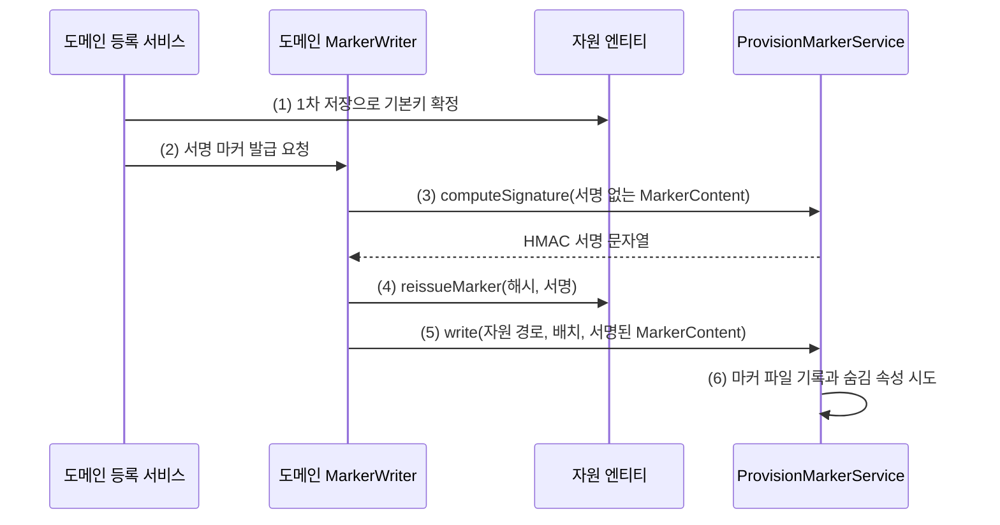
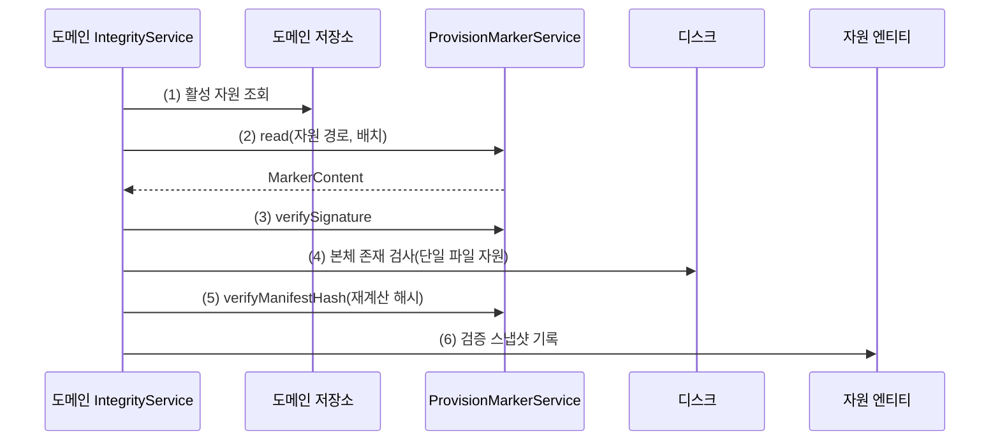
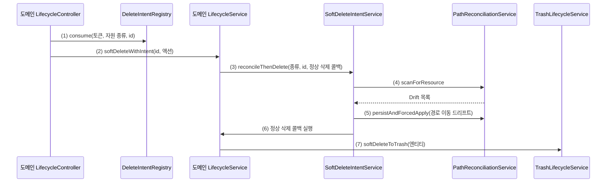
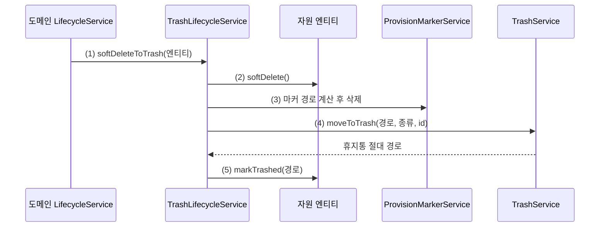
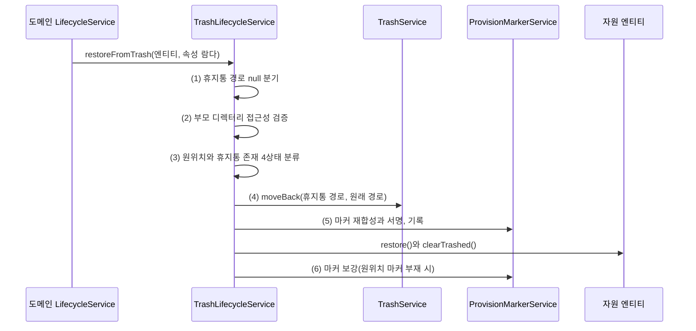
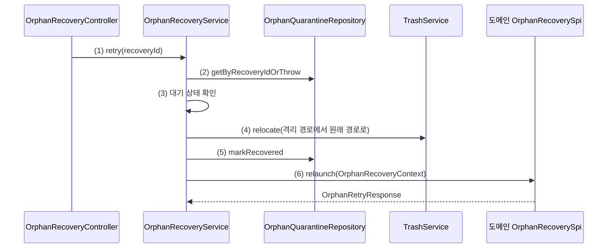
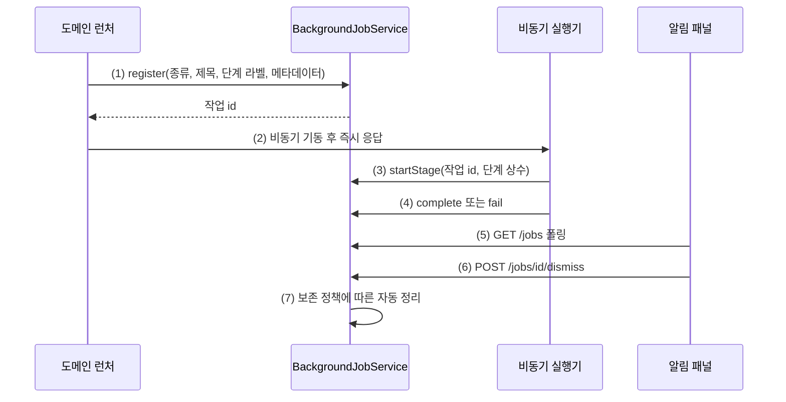
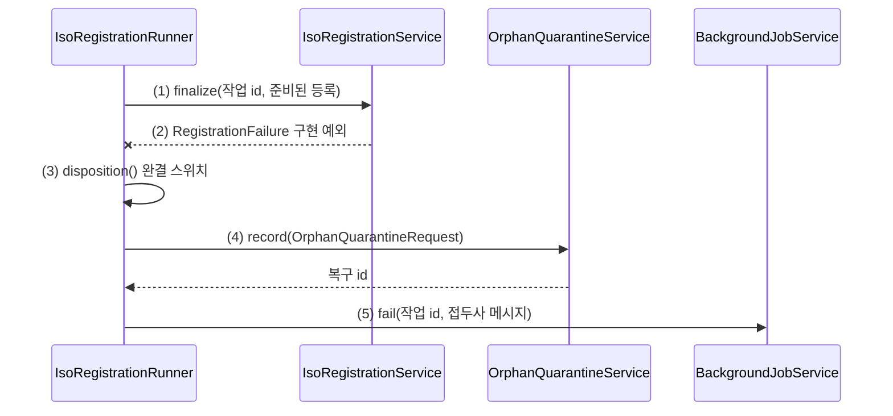
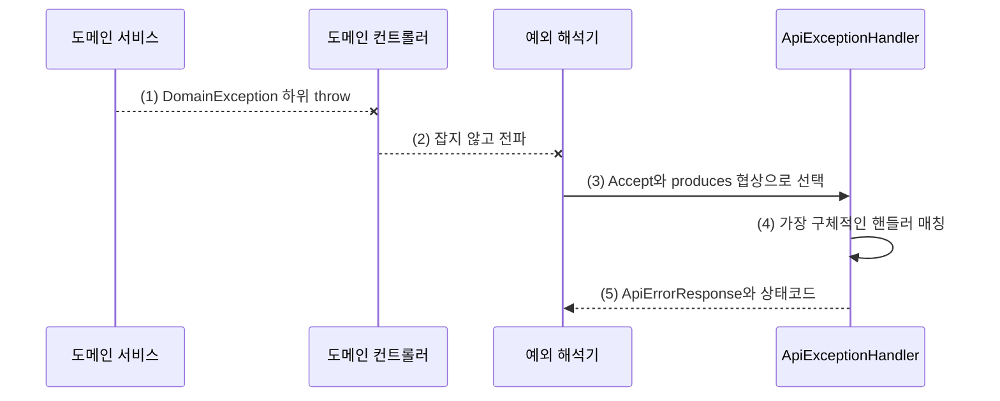

# global 인프라 상세

global은 management, maintenance, provisioning, execution 네 영역이 공유하는 도메인 무관 인프라다. 이 문서는 [architecture.md](architecture.md)의 global 절을 상세화하는 하위 문서로, 상위 개관이 한 문단으로 요약한 각 구역의 계약과 협력 관계, 대표 흐름, 확장 지점을 푼다. 자원 도메인 쪽의 사용례는 os 상세(DOC-1-2, 예정)와 board 계열 상세(DOC-1-3, 예정)가, 재조정(reconciliation) 엔진의 내부는 재조정 상세(DOC-1-5, 예정)가 잇는다.

## 개요와 기본 동작

자원 도메인 하나가 global에 제공해야 하는 것은 네 가지다. 엔티티가 `LifecycleEntity`를 상속하고 `Markable`을 구현하는 것, 도메인당 `MarkableScanner` 빈 하나, `LifecycleService`를 구현한 `*LifecycleService`, 그리고 파일 자원이라면 얇은 `*MarkerWriter`다. 이 네 가지가 갖춰지면 나머지는 이미 돌아간다.

- 상태 전이는 `LifecycleEntity`가 가드한다. 잘못된 전이는 409로 거절되고, 부모 상태 변화는 자식의 실효 상태로 자동 반영된다.
- 마커의 서명, 기록, 검증은 `ProvisionMarkerService` 엔진이 수행한다. 도메인은 속성 맵만 조립한다.
- soft-delete 시 파일이 휴지통으로 옮겨지고, 복원 시 원위치로 돌아오며 마커가 재발급된다. 보존 기한이 지나면 자동 영구삭제되고 감사 기록이 남는다.
- 영구삭제 전 자원명 입력 검증(typed-name)과 확인 모달 조각이 공용으로 제공된다.
- 재조정 스캔이 도메인의 자원 목록을 자동 수집해 디스크와 대조한다.
- 무거운 작업은 작업 카드 하나로 알림 패널에 나타나고, 실패는 처분 계약에 따라 정리, 재확인, 격리 중 하나로 수렴한다.
- 예외는 컨트롤러가 잡지 않아도 두 어드바이스(advice)가 HTTP 응답으로 바꾼다.

이 문서의 나머지는 위 기본 동작이 어떤 컴포넌트와 흐름으로 이루어지는지, 그리고 어디를 구현하면 새 도메인이 합류하는지를 구역별로 설명한다.

## 유스케이스 메뉴

- 새 자원 도메인을 마커와 수명주기 체계에 편입하려면: [신규 자원 도메인 편입 체크리스트](#신규-자원-도메인-편입-체크리스트)
- 새 자원 종류와 마커 배치 방식을 추가하려면: [마커 체계 편입 방법](#마커-체계-편입-방법)
- 영구삭제 전에 자원명 입력 검증을 붙이려면: [자원명 입력 검증](#자원명-입력-검증)
- 백그라운드 작업을 새로 추가하려면: [백그라운드 작업 확장점](#백그라운드-작업-확장점)
- 새 예외를 HTTP 응답에 매핑하려면: [예외 확장점](#예외-확장점)
- 등록 실패 예외를 새로 정의하려면: [처분 확장점](#처분-확장점)
- 등록 실패로 격리된 파일의 복구에 도메인을 합류시키려면: [휴지통과 격리 확장점](#휴지통과-격리-확장점)
- 부모 상태에 따른 자식 차단 조건을 손보려면: [수명주기 엔티티](#수명주기-엔티티)
- 파일 존재 검사를 다른 저장소 구현으로 교체하려면: [수명주기 확장점](#수명주기-확장점)
- 예외 문자열로 원인을 찾으려면: [실패와 문제 해결](#실패와-문제-해결)

## 공통 개념과 배경

### 마커가 왜 필요한가

자원 하나는 디스크의 실물과 DB의 행으로 이중 존재한다. 관리자는 파일시스템을 직접 만질 수 있으므로 둘은 언제든 어긋날 수 있다. 파일이 옮겨졌는지, 내용이 바뀌었는지, 다른 서버에서 이식됐는지를 판정하려면 실물 옆에 자기 정체를 증명하는 기록이 있어야 한다. 그 기록이 마커 파일 `.provision.json`이다. 마커는 자원의 종류와 id, 등록 시점의 내용 해시를 담고, 서버만 아는 비밀 키로 HMAC(Hash-based Message Authentication Code) 서명된다. 서명이 있으므로 마커 자체의 위조나 외부 이식도 감지된다. 파일의 위치는 파일시스템이 기준이고 수명주기 상태는 DB가 기준이라는 방향별 원칙은 [architecture.md](architecture.md)의 역할 분담 절이 설명하며, 마커는 그 두 세계를 잇는 열쇠, 즉 (자원 종류, 자원 id) 키를 실물 옆에 박아 두는 장치다.

### 수명주기 축이 왜 이렇게 나뉘나

자원의 수명주기는 세 boolean 축으로 표현된다. 사용 가능 여부(enabled), 구식 표기(deprecated), 삭제 여부(deleted)다. 세 축은 서로 독립이다. deprecated는 새 등록에서 우선순위를 낮출 뿐 사용을 막지 않으므로 enabled를 끄지 않고, soft-delete는 deprecated 값을 보존하므로 복원하면 이전 단계로 돌아간다.

여기에 부모 자식 연쇄(cascade)가 겹치면서 축이 하나 더 갈라졌다. 부모를 비활성화하면 자식도 실질적으로 못 쓰게 되지만, 그렇다고 자식의 설정 값을 직접 꺼 버리면 부모가 회복됐을 때 자식의 원래 의도를 복원할 수 없다. 그래서 운영자의 본래 의도인 자체 값(own)과 부모 연쇄를 반영한 실효 값(effective)을 분리했다. 연쇄는 실효 값만 다시 계산하고 자체 값은 절대 건드리지 않는다. 부모가 돌아오면 보존된 자체 값으로 자식이 자동 복원된다.

### 휴지통과 격리가 왜 다른가

파일이 사용자 시야에서 사라지는 경로는 둘인데, 두 경로는 키가 다르다.

휴지통(trash)은 등록이 완료되어 DB 행과 기본키를 가진 자원이 soft-delete될 때 가는 곳이다. 디렉터리 구조도 (자원 종류, 자원 id)로 짜이고, 보존 기한은 기본 30일이며, 출구는 복원 아니면 영구삭제다.

격리(quarantine)는 등록이 인프라 사정으로 좌절되어 DB 행도 마커도 없는 파일이 가는 곳이다. 기본키가 없으므로 휴지통의 키 체계를 쓸 수 없고, 복구 결정(재시도 또는 폐기)을 담을 상태 변화가 필요한데 영구삭제 감사 기록인 `PurgeLog`는 추가 전용이라 가변 상태를 담을 수 없다. 그래서 무작위 복구 id를 키로 하는 별도 엔티티 `OrphanQuarantine`이 존재한다. 보존 기한도 7일로 휴지통보다 짧게 의도했고, 자동 정리 시각도 휴지통 정리(매시 정각)와 어긋난 매시 30분에 배치했다.

### 예외 계층이 왜 둘인가

도메인 예외는 `DomainException` 한 뿌리 아래에 있고 두 어드바이스가 HTTP 응답으로 바꾼다. 그런데 보안 예외는 이 계층에 넣지 않았다. 과거 컨트롤러의 `catch (DomainException)`이 보안 예외까지 흡수해 아무 응답 규약 없는 500으로 새는 사고가 있었기 때문이다. 보안 예외를 `DomainException` 밖의 별도 계층 `SecurityException`으로 분리하면, 도메인 예외를 잡는 코드가 보안 예외를 구조적으로 잡을 수 없게 되어 같은 사고가 타입 수준에서 차단된다.

## 컴포넌트 지도

```mermaid
classDiagram
    class LifecycleManageable { <<interface>> }
    class Markable { <<interface>> }
    class LifecycleEntity { <<abstract>> }
    class LifecycleService { <<interface>> }
    class MarkableInventory { <<interface>> }
    class MarkableDriftApplier { <<interface>> }
    class MarkableGhostOperator { <<interface>> }
    class MarkableTrashOperator { <<interface>> }
    class MarkableScanner { <<interface>> }
    class ProvisionMarkerService
    class TrashService
    class TrashLifecycleService
    class PurgeExecutor { <<interface>> }
    class TypedNameVerifier { <<interface>> }
    class TypedNameGuard
    class SoftDeleteIntentService
    class DeleteIntentRegistry
    class ResourceExistenceChecker { <<interface>> }
    class OrphanQuarantineService
    class OrphanRecoveryService
    class OrphanRecoverySpi { <<interface>> }
    class BackgroundJobService
    class RegistrationFailure { <<interface>> }
    class FailureDisposition { <<interface>> }
    class DomainException { <<abstract>> }
    class ApiExceptionHandler
    class WebExceptionHandler

    Markable --|> LifecycleManageable
    LifecycleEntity ..|> LifecycleManageable
    MarkableScanner --|> MarkableInventory
    MarkableScanner --|> MarkableDriftApplier
    MarkableScanner --|> MarkableGhostOperator
    MarkableScanner --|> MarkableTrashOperator
    TrashLifecycleService --> TrashService
    TrashLifecycleService --> ProvisionMarkerService
    TrashLifecycleService ..> Markable
    PurgeExecutor ..> MarkableScanner
    TypedNameVerifier ..> MarkableInventory
    TypedNameGuard ..> Markable
    SoftDeleteIntentService --> DeleteIntentRegistry
    SoftDeleteIntentService ..> MarkableGhostOperator
    SoftDeleteIntentService --> ResourceExistenceChecker
    OrphanQuarantineService --> TrashService
    OrphanQuarantineService --> ProvisionMarkerService
    OrphanRecoveryService --> TrashService
    OrphanRecoveryService ..> OrphanRecoverySpi
    RegistrationFailure ..> FailureDisposition
    ApiExceptionHandler ..> DomainException
    WebExceptionHandler ..> DomainException
```



관계를 산문으로 다시 읽으면 이렇다. 자원 엔티티는 `LifecycleEntity`를 상속해 상태 전이 가드를 얻고, `Markable`을 구현해 마커 체계에 자기를 노출한다. `Markable`은 `LifecycleManageable`을 확장하므로 마커 인프라는 자원의 수명주기 상태도 함께 읽을 수 있다. `MarkableScanner`는 네 하위 인터페이스의 합성이고, 도메인은 합성 하나를 구현하되 소비자는 자기가 쓰는 좁은 하위 인터페이스만 주입받는다. `TrashLifecycleService`는 soft-delete와 복원의 공통 절차를 담당하며 파일 이동은 `TrashService`에, 마커 재발급은 `ProvisionMarkerService`에 위임한다. `PurgeExecutor`는 영구삭제 진입 경로가 통과하도록 설계된 단일 집행기이고 도메인별 삭제를 스캐너에 위임한다. 재확인 교체 경로만 현재 이 집행기를 지나지 않는데, 그 비대칭은 영구삭제 집행기 절의 참고에서 설명한다. `SoftDeleteIntentService`는 삭제 전 사전조건 검사(파일 실존은 `ResourceExistenceChecker`에 묻는다)와 정정 후 삭제 사가(saga, 보상 가능한 다단계 절차)를 담당한다. `OrphanQuarantineService`는 격리 이동에 `TrashService`를, 사이드카 형제 마커 정리에 `ProvisionMarkerService`를 쓴다. `OrphanRecoveryService`는 격리 파일의 복구를 도메인별 `OrphanRecoverySpi`에 위임한다. `RegistrationFailure`를 구현한 등록 실패 예외는 자신의 처분을 `FailureDisposition`으로 선언한다. `DomainException` 계층은 두 어드바이스가 채널별로 응답으로 바꾼다. `LifecycleService`는 이 그림에서 홀로 서 있는데, 도메인 서비스들이 시그니처를 통일하기 위해 구현하는 계약이고 global 안에서 이를 주입받는 소비자는 없기 때문이다.

## 마커

global의 `marker` 패키지는 마커의 형식(`MarkerContent`, `MarkerLayout`), 엔진(`ProvisionMarkerService`), 도메인이 구현하는 두 계약(`Markable`, `MarkableScanner`), 그리고 검증 어휘(`IntegrityStatus`, `DriftKind`)로 이루어진다. 서명과 검증 로직은 엔진 한 곳에만 있고, 도메인은 계약 구현으로 합류한다.

### 마커 발급 흐름

관리자가 자원을 등록할 때 도메인 등록 서비스가 마커를 발급한다. 엔티티 저장으로 기본키가 확정된 뒤에야 서명할 수 있으므로 두 단계 저장(2-phase save)이 된다.



1. 도메인 서비스가 엔티티를 저장해 기본키(`Long`)를 확정한다. 이 시점의 `getMarkerSignature()`는 null이며, `Markable` 계약상 마커 미발급 상태의 정상 표현이다.
2. 도메인별 `*MarkerWriter`(`BiosMarkerWriter`, `BmcMarkerWriter`, `SubprogramMarkerWriter`)에 발급을 요청한다. ISO는 별도 writer 없이 `IsoRegistrationService`가 같은 절차를 내장하며, 사이드카 자원이므로 발급 전에 `resolveMarkerFile`로 사이드카 경로의 선점 여부를 검사해 이미 존재하면 `SidecarConflictException`을 던진다.
3. writer가 서명 없는 `MarkerContent`(자원 종류 문자열, 기본키, 도메인 속성 맵, 발급 시각, 내용 해시, 서명 null)를 조립해 `computeSignature`를 호출한다. 반환값은 HMAC-SHA256 16진수 문자열이다.
4. `entity.reissueMarker(manifestHash, signature)`로 해시와 서명을 엔티티 필드에 반영한다. 2차 저장은 트랜잭션 flush가 담당한다.
5. `write`가 서명을 채운 사본(`withSignature`)을 디스크에 기록한다.
6. 기록 후 Windows 숨김 속성을 시도하고, 지원하지 않는 OS의 실패는 흡수한다. 발급 성공에 영향이 없다.

발급 절차를 코드로 요약하면 다음 네 줄이고, 이 순서는 불변이다.

```java
MarkerContent unsigned = new MarkerContent(type.name(), id, attributes,
        Instant.now(), manifestHash, null);                               // (1)
String signature = markerService.computeSignature(unsigned);              // (2)
entity.reissueMarker(manifestHash, signature);                            // (3)
markerService.write(path, layout, unsigned.withSignature(signature));     // (4)
```

1. writer는 관례상 서명 필드를 null로 조립한다. 엔진의 `computeSignature`는 내부에서 `withoutSignature` 사본으로 직렬화하므로 서명 필드는 어떤 값이든 서명 대상에 포함되지 않는다.
2. 기본키 확정 전에 서명하면 자원 id 없는 마커가 서명되어 버리므로, 이 줄은 반드시 1차 저장 뒤에 온다.
3. 엔티티 반영이 디스크 기록보다 앞선다. 디스크 기록이 실패하면 트랜잭션 롤백으로 엔티티 반영도 함께 취소되기 때문이다.
4. 기록 실패(디스크 가득 참, 권한 없음)는 `MarkerWriteFailedException`으로 전파되어 500이 된다. 후속 처리는 등록 경로별로 다르다. 번들 업로드 경로는 등록 서비스의 보상 catch가 `BundleTreeCleanupService`로 업로드 트리를 정리하고, 기존 디렉터리 등록은 운영자 자산이라 정리하지 않으며, ISO는 `IsoMarkerWriteFailedException`으로 감싸져 파일을 보존하는 격리 처분으로 흐른다.

### 마커 검증 흐름

검증 경로는 둘이다. 관리 화면의 단건 검증 액션과 재조정의 전역 스캔이다. 두 경로 모두 판정 순서가 같다. 서명 검증을 본체 존재 검사보다 앞에 두는데, 변조 의심이라는 보안 신호가 자원 부재라는 운영 신호보다 먼저 노출되어야 하기 때문이다.

단건 검증은 도메인별 `*IntegrityService`의 검증 기록 메서드가 수행한다. `IsoIntegrityService`는 `verifyAndRecord`, `BiosIntegrityService`와 `BmcIntegrityService`, `SubprogramIntegrityService`는 `verifyAndRecordIntegrity`라는 이름을 쓰며 네 도메인이 같은 골격을 공유한다.



1. 활성 자원을 저장소에서 직접 조회한다. 삭제된 자원이면 도메인 예외로 거절한다.
2. `ProvisionMarkerService.read`로 마커를 역직렬화한다. `MarkerMissingException`은 잡아서 `IntegrityStatus.MARKER_MISSING` 상태값으로 환원한다. 예외를 상태로 바꾸는 것이 정상 경로다.
3. `verifySignature` 실패는 `SIGNATURE_INVALID`가 된다.
4. 단일 파일 자원인 ISO만 서명 검증 뒤 본체 존재 검사를 별도로 수행해 실패 시 `TAMPERED`로 환원한다. 번들 3종에는 이 단계가 없다. 트리 루트가 사라지면 트리 안의 마커도 함께 사라져 2단계에서 `MARKER_MISSING`이 되고, 루트가 존재하되 디렉터리가 아니면 해시 계산이 `BundleExtractionException`으로 이탈해 상태값이 아닌 500이 된다.
5. 본체에서 해시를 재계산(단일 파일은 SHA-256 스트리밍, 번들은 정규화된 트리 해시)해 `verifyManifestHash`로 비교한다. 불일치는 `TAMPERED`, 일치는 `ORIGINAL`이다.
6. 결과와 시각을 엔티티 스냅샷으로 영속화한다. 조회 경로는 이 스냅샷만 읽으며 기본값은 `NOT_VERIFIED`다.

전역 스캔은 `PathReconciliationService`가 모든 `MarkableScanner`의 인벤토리를 합산해 디스크의 마커 전수와 대조하고, 어긋남을 `DriftKind`로 분류해 보고한다. 분류 규칙과 해결 절차의 상세는 재조정 상세 문서의 소관이므로 여기서는 마커 관점의 요점만 적는다. 스캔은 (자원 종류, 자원 id) 키로 마커를 매칭하므로 파일과 마커가 함께 이동한 경우를 경로 이동(`PATH_DRIFT`)으로 잡아내고, 마커만 이동하고 본체가 따라오지 않은 경우는 자동 적용이 위험하므로 자원 소실(`MISSING`)로 강등해 운영자 검토를 강제한다.

> 주의: `ProvisionMarkerService.read`는 파일 부재에는 `MarkerMissingException`을, JSON 파싱 실패에는 이름과 달리 `MarkerWriteFailedException`을 던진다. 검증 흐름은 전자만 잡아 상태값으로 환원하고 후자는 500으로 흘려보내는 구분이 의도다. 파싱 실패까지 상태값으로 흡수하면 깨진 마커가 조용히 묻힌다.

### 마커 엔진

`ProvisionMarkerService`는 마커의 경로 계산, 직렬화, HMAC 서명, 검증을 전담하는 도메인 무관 엔진 하나다. 도메인별 writer들과 등록 서비스가 발급을 위해, 무결성 서비스 4종과 재조정 엔진, 휴지통 인프라가 검증과 재발급을 위해 이 엔진을 주입받는다. 엔진 자신은 Jackson `ObjectMapper`와 `javax.crypto.Mac`만 사용하며 어떤 도메인도 모른다.

- 역할과 용도: `resolveMarkerFile`이 배치 규칙에 따라 마커의 디스크 경로를 계산하고, `write`와 `read`가 기록과 역직렬화를, `computeSignature`와 `verifySignature`, `verifyManifestHash`가 서명 생성과 두 축의 검증을 담당한다. 서명과 해시 비교는 타이밍 공격에 대비한 상수시간 비교다.
- 구성요소와 필드: 마커 파일명 상수(`.provision.json`), 정렬이 강제된 전용 mapper, 환경변수 `PROVISION_MARKER_SECRET`에서 읽는 서명 키. 기동 시 `@PostConstruct` 가드가 개발용 기본 키로 운영 프로필이 부팅되는 것을 `IllegalStateException`으로 중단시킨다.

> 주의: 서명의 전제는 직렬화 결정론이다. 엔진의 mapper는 속성과 맵 키를 알파벳 순으로 강제 정렬한다. `Map.of`의 순회 순서는 JVM 인스턴스마다 달라서, 정렬 없이는 서버 재시작 후 같은 데이터의 재계산 서명이 어긋나 `SIGNATURE_INVALID` 오탐이 난다. 이 mapper 설정은 완화하면 안 된다.

> 참고: 서명 키를 회전하면 기존 마커 전체가 서명 불일치가 된다. 재조정의 일괄 서명 재발급 도구가 마이그레이션을 담당하며, 재발급 시 내용 해시는 유지해 변조 가능성을 굳히지 않는다.

### 마커 내용과 배치

`MarkerContent`는 `.provision.json`의 직렬화 형식인 record다. 자원 종류 문자열, 자원 id, 도메인별 속성 맵(`Map<String, String>`), 발급 시각, 내용 해시, 서명으로 구성되고, `withoutSignature`가 서명 계산용 사본을, `withSignature`가 계산된 서명을 채운 기록용 사본을 만든다. 도메인 고유 정보를 속성 맵에 흡수했기 때문에 인프라는 도메인을 모른 채 검증만 수행한다. BIOS는 보드 id와 버전, 진입점 상대경로를, ISO는 부모 id와 원본 파일명을 속성으로 넣는다.

`MarkerLayout`은 마커 파일의 위치 규칙 enum이다. `IN_TREE`는 디렉터리 자원의 트리 루트 안에 `.provision.json` 하나를 두는 방식이고, `SIDECAR`는 단일 파일 자원의 형제로 마커를 두는 방식이다. 예를 들어 `x.iso`의 사이드카 마커는 `x.iso.provision.json`이 된다. `write`는 `IN_TREE`면 디렉터리를 자동 생성하지만 `SIDECAR`는 부모 디렉터리가 이미 있어야 하는 비대칭이 있고, 사이드카 선점 검사는 등록 서비스의 책임이다.

`ResourceType`은 마커가 부착될 수 있는 자원 종류 enum이다. 상수마다 기본 배치(`defaultLayout`), 메타 자원 여부(`metadata`), 화면 표시명을 보유한다. 파일 자원 4종(`BIOS_BUNDLE`, `OS_ISO`, `BMC_FIRMWARE`, `SUBPROGRAM`)과 메타 자원 2종(`OS_IMAGE`, `BOARD_MODEL`)이 있다. 메타 자원은 파일 실체가 없어 마커 발급과 휴지통 파일 이동, 재조정 분류에서 제외되고 수명주기 메타만 활용한다.

> 주의: 메타 자원을 재조정 분류나 휴지통 이동에서 명시적으로 제외하지 않으면 경로가 없어 널 참조나 유령 행(ghost row) 오탐이 난다. `PathReconciliationService`와 휴지통 컨트롤러의 `metadata` 가드가 선례다.

### 마커 부착 계약

`Markable`은 마커가 부착될 수 있는 도메인 자원의 어댑터 인터페이스로, `LifecycleManageable`을 확장한다. 자원 엔티티 6종(`BoardBIOS`, `BoardBMC`, `BoardModel`, `ISO`, `OSMetadata`, `Subprogram`)이 구현하며, 인프라는 도메인을 모른 채 이 메서드들만으로 발급과 검증, 휴지통 처리를 수행한다.

- 역할과 용도: 자원의 정체(`getResourceId`, `getResourceType`, `getResourcePath`)와 무결성 스냅샷(`getManifestHash`, `getMarkerSignature`), 재발급 반영(`reissueMarker`)을 노출한다. `getMarkerSignature()`가 null이면 두 단계 저장의 중간이거나 마이그레이션 전 자원이라는 정상 상태다.
- 구성요소와 필드: `displayName()`은 사용자 표시와 자원명 입력 검증의 기준이 되는 합성 자원명으로, 엔티티 한 곳에만 두는 단일 진실 출처(SSOT, Single Source of Truth)다. `getParentMarkable()`은 자식 자원이 부모를 반환하도록 재정의해 휴지통 화면의 부모 자식 들여쓰기에 쓰인다. `getMarkerLayout()`은 기본으로 `ResourceType`의 기본 배치에 위임한다.

### 자원 목록 공급 계약

`MarkableScanner`는 도메인별 자원 인벤토리를 인프라에 공급하는 확장점(SPI, Service Provider Interface)이다. 원래 19 메서드의 비대한 인터페이스였던 것을 인터페이스 분리 원칙(ISP, Interface Segregation Principle)에 따라 네 책임으로 나눴고, 도메인은 합성인 `MarkableScanner` 하나를 구현하되 소비자는 좁은 하위 인터페이스만 주입받는다.

- `MarkableInventory`: 조회 전용이다. 활성 자원 전수(`findActiveMarkables`), 휴지통 자원(`findTrashed` 계열), 유령 행 판정을 제공한다. 모두 저장소 직접 조회라 도메인 서비스를 역참조하지 않는다. 기본 구현이 전체 목록의 필터라서 단건 조회(`findActiveMarkableById`, `findTrashedById`)는 저장소 단건 조회로 재정의하는 것이 권장 계약이다.
- `MarkableDriftApplier`: 재조정 책임이다. 경로 이동의 자동 적용(`applyDriftedPath`)과 정밀 점검의 해시 재계산(`recomputeManifestHash`)을 담당한다. 재계산이 `Optional.empty()`를 반환하면 본체가 사라졌다는 신호이고 재조정은 이를 자원 소실로 노출한다.
- `MarkableGhostOperator`: 유령 행(삭제 표시 행만 남고 파일이 어디에도 없는 상태)의 정리 책임이다. 정리가 저장소 삭제 한 줄이라 역참조가 없다.
- `MarkableTrashOperator`: 휴지통 운영 책임이다. 복원과 영구삭제, 보존기간 연장은 도메인 서비스 호출이 불가피해서, 스캐너에서 도메인 서비스로 향하는 유일한 의존 변이다.

합성 `MarkableScanner`에는 자원명 검증을 적용한 영구삭제 기본 메서드가 있다. 휴지통 단건 조회와 영구삭제 두 책임을 합성하기 때문에 하위 인터페이스가 아닌 합성에 위치한다.

> 주의: 도메인 서비스에 `TypedNameVerifier`, `MarkableScanner`, `ObjectProvider`를 주입하면 서비스에서 스캐너로, 스캐너에서 다시 서비스로 도는 생성자 순환이 재생성된다. 이 금지는 CLAUDE.md의 불가침 규칙이다. 조회가 필요한 인프라는 서비스 역참조가 없는 `MarkableInventory`만 좁게 주입받고(`TypedNameVerifierImpl`, `TrashTtlWorker` 선례), `SoftDeleteIntentService`의 `MarkableGhostOperator` 목록 주입에는 `@Lazy`가 필수다.

> 참고: 후속 계획(R7-2부터 R7-6)에서는 `MarkableTrashOperator` 책임을 각 도메인의 `*LifecycleService`가 직접 구현하도록 옮겨 합성에서 떼어낼 예정이다. 그러면 스캐너의 서비스 의존이 0이 되어 순환의 뿌리가 사라진다. 또한 `MarkableGhostOperator`는 유령 행 신규 생성 차단이 확정되면 일괄 제거될 한시적 안전망이므로 여기에 새 책임을 얹지 않는다.

### 검증 어휘

`IntegrityStatus`는 단건 검증 액션의 결과 enum이다. `ORIGINAL`, `TAMPERED`, `SIGNATURE_INVALID`, `MARKER_MISSING`, `NOT_VERIFIED` 다섯 상수가 각자 사용자 안내 문구를 보유해 검증 작업 카드와 목록 배지의 문구 분기를 대체한다. `DriftKind`는 전역 스캔의 발견물 어휘로, 상수마다 사용자 노출 명칭과 설명, 권장 조치, 해결 방식(`DriftResolutionMode`의 `NONE`, `MANUAL`, `AUTO` 3단), 재점검 지원 여부를 데이터로 보유한다. 두 enum은 별개 축이다. 전자는 자원 하나의 검증 스냅샷이고 후자는 스캔이 만든 `Drift` 기록의 분류다. 상수 목록과 해결 절차는 재조정 상세 문서가 다룬다.

### 마커 체계 편입 방법

새 자원 종류를 마커 체계에 편입하는 확장점은 네 개이고, 전부 구현 추가만으로 합류한다.

자원 엔티티가 `Markable`을 구현한다고 할 때, 별도 등록 없이 필수 접근자와 `reissueMarker`를 제공하고 `displayName()`과 (자식 자원이면) `getParentMarkable()`을 재정의하면 발급, 검증, 휴지통, 재조정의 공통 흐름에 합류한다. 적용 조건은 엔티티가 `LifecycleEntity`를 함께 상속하는 것이다. `TrashLifecycleService`가 두 타입의 교집합(`<T extends LifecycleEntity & Markable>`)을 요구하기 때문이다.

`ResourceType`에 상수를 추가한다고 할 때, 기본 배치와 메타 자원 여부, 표시명을 지정하면 마커와 화면 어휘에 합류한다. 파일 실체가 없는 자원은 `metadata`를 true로 선언해 파일 관련 흐름에서 스스로를 제외시킨다.

도메인 `*MarkerWriter`를 만든다고 할 때, `ProvisionMarkerService` 하나만 주입받는 `@Component`로 위 발급 4단계를 한 메서드에 응집한다. 신규 업로드, 기존 디렉터리 등록, 재확인 후 재등록 같은 복수의 등록 경로가 모두 이 한 곳을 호출하게 만드는 것이 목적이다.

도메인 `MarkableScanner` 구현을 `@Component` 빈으로 등록한다고 할 때, `supportedType()`이 자기 `ResourceType`을 반환하면 Spring이 `List<MarkableScanner>`와 하위 인터페이스별 목록으로 자동 수집한다. 별도 레지스트리는 없다. 현재 구현은 도메인당 하나씩 6종(`BoardBiosMarkableScanner`, `BoardBmcMarkableScanner`, `BoardModelMarkableScanner`, `IsoMarkableScanner`, `OSMetadataMarkableScanner`, `SubprogramMarkableScanner`)이다.

```java
@Component
public class MyResourceMarkableScanner implements MarkableScanner {

    private final MyResourceRepository repository;
    // ...

    @Override
    public ResourceType supportedType() {
        return ResourceType.MY_RESOURCE;
    }
    // findActiveMarkables 등 조회 메서드는 repository 위임으로 구현하고,
    // 단건 조회는 기본 구현 대신 repository 단건 조회로 재정의한다
}
```

## 수명주기

global의 `lifecycle` 패키지는 자원 도메인의 수명주기 명령 표면을 통일하는 `LifecycleService` 계약, 상태 전이와 어휘 환산을 맡는 `LifecycleManageable`과 `LifecycleStage`, 삭제 전 사전조건과 정정 후 삭제 사가를 담당하는 `SoftDeleteIntentService` 계열로 이루어진다. 엔티티 공통 부모인 `LifecycleEntity`는 `entity` 패키지에 있지만 수명주기 체계의 몸통이므로 이 장에서 함께 다룬다.

### 수명주기 명령 계약

`LifecycleService`는 자원 도메인의 수명주기 명령 7종을 통일하는 인터페이스로, 도메인별 `*LifecycleService` 6종(`OSMetadataLifecycleService`, `IsoLifecycleService`, `BoardModelLifecycleService`, `BiosLifecycleService`, `BmcLifecycleService`, `SubprogramLifecycleService`)이 구현한다. 시그니처 통일이 목적인 계약이며, 의존성 주입은 구현체의 구체 타입으로 한다. 도메인별 컨트롤러가 자기 자원의 구체 서비스만 의존하기 때문이다.

- 역할과 용도: `toggleEnabled`, `softDelete`, `restore`, `deprecate`, `undeprecate`, `purge`, `purgeWithTypedNameCheck`가 활성 토글부터 영구삭제까지의 명령 표면이다. 부모 자식 연쇄 정책은 인터페이스가 아니라 구현체의 책임이다.
- 구성요소와 필드: `restore`는 오버로드 2개다. 추상 메서드는 연쇄 옵션을 받는 `restore(Long, boolean)` 하나이고, `restore(Long)`은 그리로 위임하는 기본 메서드다. 반환 타입 `RestoreResponse`는 함께 복구된 자식 수를 담는다.

```java
@Override
@Transactional
public void restore(Long id) {   // (1)
    restore(id, false);          // (2)
}
```

1. 기본 메서드를 그대로 두면 자기 호출(self-invocation)이라 `@Transactional` 프록시를 우회한다. 단일 인자 restore가 실제로 호출되는 진입점이 있는 구현체는 반드시 이렇게 재정의해야 트랜잭션 경계가 생긴다. 실제로 이 누락이 사고로 이어져 핫픽스(HF-1)에서 수정된 이력이 있고, 잎 도메인 4종(`IsoLifecycleService`, `BiosLifecycleService`, `BmcLifecycleService`, `SubprogramLifecycleService`)이 같은 형태로 재정의하고 있다. 컨트롤러와 스캐너가 전부 2인자 restore만 호출하는 `OSMetadataLifecycleService`와 `BoardModelLifecycleService`는 기본 메서드를 그대로 쓴다.
2. 잎 도메인은 연쇄할 자식이 없으므로 false 위임으로 자연 처리된다.

### 상태 어휘와 전이 가드

`LifecycleManageable`은 deprecate, soft-delete, 복원이 가능한 엔티티가 구현하는 인터페이스로, `LifecycleEntity`가 유일한 직접 구현이다. 전이 메서드(`deprecate`, `undeprecate`, `softDelete`, `restore`)는 잘못된 전이에 `IllegalDeprecationStateException` 또는 `IllegalLifecycleTransitionException`을 던지는데, 둘 다 `ConflictException` 하위라 409가 된다. 정상 화면 흐름에서는 UI가 버튼 비활성화로 먼저 차단하므로 이 가드는 직접 POST와 동시성, 낡은 화면 같은 비정상 경로의 안전망이다.

`LifecycleStage`는 두 boolean 조합을 사람이 읽는 어휘로 환산하는 enum이다. `of(isDeprecated, isDeleted)`가 유일한 산출 진입점이고, 삭제가 우선이라 `is_deprecated`가 true여도 `is_deleted`가 true면 `SOFT_DELETED`다. 예를 들어 deprecated 상태의 자원을 soft-delete하면 단계는 `SOFT_DELETED`가 되지만 deprecated 값은 보존되어, 복원하면 `DEPRECATED`로 돌아온다. 행이 없는 상태를 뜻하는 PURGED 상수는 의도적으로 없다. 행 부재는 상태가 아니기 때문이다. enabled 축도 이 어휘에 반영되지 않는 별개 차원이다.

### 수명주기 엔티티

`LifecycleEntity`는 운영자가 직접 관리하는 자원 엔티티 6종의 공통 부모인 `@MappedSuperclass` 추상 클래스로, `LifecycleManageable`을 구현한다. 감사 시각, 수명주기 boolean 다섯 개(실효 2, 삭제 1, 자체 2), 휴지통 시각과 경로, 전이 가드를 한 곳에 모은다. 하위 엔티티는 세 훅을 구현한다. 가드 메시지용 기본키를 주는 `resourceId()`, 실효 값 재계산의 입력인 부모 자원을 주는 `parentLifecycle()`(루트와 공용 자원은 null), 선택적으로 가드 메시지의 도메인 라벨을 주는 `resourceLabel()`이다.

자체 값과 실효 값의 계산 규칙은 `recomputeEffective()` 하나에 있다. 실효 deprecated는 자체 deprecated와 부모 deprecated의 논리합, 실효 enabled는 자체 enabled와 부모 enabled의 논리곱이다. 예를 들어 자식 BIOS의 자체 enabled가 true인 상태에서 부모 보드를 비활성화하면 자식의 실효 enabled만 false가 되고 자체 값은 true로 남는다. 부모를 다시 활성화하면 보존된 자체 값으로 자식이 자동 복원된다. 재계산 호출 지점은 네 곳이다. 운영자의 자체 값 전이, 부모 연쇄(서비스 측), 자식 복원, 그리고 insert 직전의 `@PrePersist` 훅이다. 마지막 훅 덕에 부모가 비활성인 상태에서 만든 자식도 생성 즉시 부모를 반영한다.

두 차원은 독립이다. 부모의 deprecate는 자식의 실효 deprecated만 만들고 enabled를 끄지 않는다. `childEnableBlockReason()`도 삭제와 비활성만 차단 사유로 보고 deprecated는 사유가 아니다.

`childEnableBlockReason()`과 `blocksChildEnable()`, `blocksChildRestore()`, `blocksChildUndeprecate()`는 부모 상태에 따른 자식 액션 차단 조건의 단일 진실 출처다. 화면 응답 객체의 버튼 비활성 플래그와 서버 가드(`ChildLifecycleBlockedByParentException`을 던지는 조건)가 같은 메서드를 호출한다. 조건을 바꿀 일이 있으면 반드시 이 메서드 안에서만 바꾼다. 어느 한쪽에 조건을 복사하면 화면과 서버가 어긋난다.

휴지통 필드의 순서 계약도 이 클래스에 있다. soft-delete는 `softDelete()` 호출, 파일 이동, `markTrashed(경로)` 순이고, 복원은 파일 복귀, `restore()`, `clearTrashed()` 순이다. `is_deleted`가 true인데 `trashed_path`가 null인 조합은 정상 상태가 아니라 자원이 어디에도 없는 유령 상태의 표식이다. soft-delete가 도메인의 경로 컬럼을 건드리지 않는 것도 의도로, 운영자가 지정한 원위치가 복원의 기준으로 보존된다.

`BaseTimeEntity`는 수명주기가 필요 없는 엔티티(세팅 정의서, 게스트 서버 애그리거트, 드리프트 보고서 등)의 생성 수정 시각 공통 부모다.

> 주의: `LifecycleEntity`는 `BaseTimeEntity`를 상속하지 않는다. `BaseTimeEntity`가 `@SuperBuilder`가 아니어서 빌더 상속이 호환되지 않기 때문이며, 두 부모가 같은 이름의 감사 컬럼을 각자 보유하는 것은 의도된 독립이다. 중복 제거 리팩토링을 시도하면 안 된다.

### 삭제 전 사전조건과 의도 토큰

`SoftDeleteIntentService`는 soft-delete 거절 정책의 공통 진입점으로, 도메인 수명주기 서비스들이 사전조건 검사와 두 사가를 공유하기 위해 주입받는다. 검사가 보는 것은 파일의 실존이다. `ResourceExistenceChecker.exists`가 false면 자원이 DB가 아는 위치에 없다는 뜻이므로, 그대로 삭제하면 무엇을 지웠는지가 모호해진다. 이때 서비스는 `DeleteIntentRegistry`에 5분짜리 1회용 의도(intent)를 발급해 등록한 뒤 `SoftDeleteRequiresIntentException`에 의도를 동봉해 던진다. 어드바이스가 이를 409와 구조화 응답으로 바꿔 화면이 선택 모달을 띄운다.

사용자의 선택지는 `DeleteAction` enum의 두 가지다. `CORRECT_PATH_THEN_DELETE`는 재조정을 강제 실행해 경로를 정정한 뒤 정상 삭제하는 권장 경로이고, `FORCED_CLEAR`는 자원이 진짜 분실됐을 때 행만 정리하는 경로다. 취소 상수는 없다. 취소는 토큰을 쓰지 않고 만료시키는 흐름이기 때문이다.

`DeleteIntentRegistry`는 `ConcurrentMap` 기반의 토큰 보관소다. `consume`은 만료 검증보다 제거를 먼저 수행해 어떤 경로로도 토큰 재사용이 불가능하게 하고, 부재와 만료를 하나의 `DeleteIntentTokenExpiredException`(410)으로, 자원 불일치를 `DeleteIntentTokenMismatchException`(410)으로 거절한다. 1분 주기 스케줄러가 만료 항목을 정리하며, JVM 재시작 시 토큰은 전부 사라지고 사용자는 삭제를 다시 시도하면 된다.

`ResourceExistenceChecker`는 파일 존재 검증의 단일 진입점 인터페이스다. 서비스가 `Files.exists`를 직접 부르지 않는 이유는 호출 지점의 산개를 막고, 저장소 환경이 바뀔 때 구현체만 교체하며, 테스트에서 존재 여부를 제어하기 위해서다. 기본 구현 `LocalFileSystemResourceExistenceChecker`는 단일 디스크 가정의 `Files.exists` 위임이다.

> 참고: 사전조건 검사는 기능 플래그 `provision.softdelete.reject-on-missing`이 기본 false라 현재는 통째로 건너뛴다. 도입 직후의 회귀 차단과 즉시 롤백 경로를 위한 값이며, 운영 검증 후 true로 켠다. 정정 후 삭제와 강제 정리는 의도가 이미 발급된 뒤의 경로라 플래그와 무관하게 항상 동작한다.

### 정정 후 삭제 흐름

사용자가 거절 모달에서 정정 후 삭제를 선택하면 토큰 소모와 사가가 이어진다.



1. 컨트롤러가 URL의 토큰 문자열을 `DeleteIntentToken.parse`로 복원해 `consume`을 호출한다. 부모 자식 URL 도메인은 소속 위조 가드(`assertBelongsTo*`)를 함께 거치는데 순서는 도메인마다 다르다. BIOS와 BMC는 가드 뒤에 consume, ISO는 consume 뒤에 가드이고, 공용 외래 키 자원인 Subprogram은 가드 자체가 없다. 제거가 먼저이므로 consume 시점에 토큰은 소모된다.
2. 도메인 서비스의 `softDeleteWithIntent`가 액션에 따라 사가로 분기한다.
3. `reconcileThenDelete`는 도메인 고유 부분인 정상 삭제 경로를 `Runnable` 콜백으로 받는다. 공통 사가와 도메인 로직이 이 경계로 분리된다.
4. `scanForResource`가 그 자원 하나에 대한 표적 스캔을 수행해 `List<Drift>`를 반환한다. 경로 이동 드리프트가 없으면 재시도가 무의미하므로 즉시 `PathCorrectionFailedException`(422)이다.
5. `persistAndForcedApply`가 자동 적용 전역 설정을 우회한 강제 적용으로 DB 경로를 발견 위치로 정정한다.
6. 콜백이 정정된 위치에서 자원을 재조회해 정상 삭제를 실행한다.
7. 정상 삭제는 휴지통 이동의 공통 흐름으로 이어진다. 일시 실패는 1초, 2초 간격을 두고 최대 3회까지 시도하며, 마지막 시도의 실패는 대기 없이 즉시 `PathCorrectionFailedException`으로 멈춘다.

강제 정리를 선택한 경우에는 토큰 소모까지 같고, `forcedClear`가 자원 종류에 맞는 `MarkableGhostOperator`를 골라 검증 없는 행 삭제를 위임한다.

> 주의: `SoftDeleteIntentService` 생성자의 `@Lazy` 두 개(`PathReconciliationService`, `List<MarkableGhostOperator>`)는 스캐너에서 도메인 서비스, 도메인 서비스에서 이 헬퍼로 도는 순환을 끊는 장치다. 제거하면 컨텍스트 기동이 실패한다. 또한 재시도의 대기(합계 최대 3초)는 호출자의 트랜잭션 경계 안에서 실행되므로 커넥션 점유가 그만큼 길어진다. 이 비용은 안정성 비용으로 명시 수용된 결정이다.

### 수명주기 확장점

새 도메인의 `*LifecycleService`가 `LifecycleService`를 구현한다고 할 때, 구체 타입으로 컨트롤러에 주입되며 인터페이스 타입 주입처는 현재 없다. `restore(Long)`은 트랜잭션 프록시 진입점 확보를 위해 재정의를 권장한다.

새 엔티티가 `LifecycleEntity`를 상속한다고 할 때, 세 훅(`resourceId()`, `parentLifecycle()`, 선택적 `resourceLabel()`)만 구현하면 전이 가드, 자체 값과 실효 값 재계산, 생성 시 초기화, 자식 차단 조건의 단일 출처를 전부 상속받는다.

`ResourceExistenceChecker` 구현체를 빈으로 등록한다고 할 때, 기존 것 대신 쓰려면 `@Primary`로 올리거나 기존 구현을 `@ConditionalOnProperty`로 게이팅한다. `SoftDeleteIntentService` 호출부는 바꿀 것이 없다. 단일 메서드 인터페이스이므로 설정 클래스의 `@Bean` 메서드에서 람다로 공급할 수도 있다.

```java
@Bean
@Primary
public ResourceExistenceChecker remoteExistenceChecker(RemoteStoreClient client) {
    return path -> path != null && client.exists(path); // 분산 저장소 교체 예시
}
```

## 휴지통과 격리

global의 `trash` 패키지는 soft-delete된 자원의 파일 이동과 복원, 영구삭제 집행과 감사 기록, 자원명 입력 검증을 담당한다. `orphan` 패키지는 등록이 좌절된 파일의 격리와 복구 사가를 담당한다. 두 체계가 다른 이유는 [공통 개념과 배경](#휴지통과-격리가-왜-다른가)에서 설명했다.

### 휴지통 이동 흐름

도메인 수명주기 서비스의 `softDelete`가 `TrashLifecycleService.softDeleteToTrash`를 호출하면서 시작된다. 파일 자원 4 도메인의 수명주기 서비스와, 자식 ISO 파일을 연쇄 이동시키는 `OSMetadataLifecycleService`까지 서비스 5종이 이 단일 진입점에 수렴한다.



1. 진입 타입 바운드는 `LifecycleEntity`와 `Markable`의 교집합이다. 헬퍼는 도메인을 모른 채 이 두 계약만 사용한다.
2. `softDelete()`가 DB 수명주기를 전이한다. 아직 트랜잭션 안이라 이후 실패 시 롤백된다.
3. 활성 위치의 마커를 `resolveMarkerFile`로 계산해 삭제한다. 삭제 실패는 경고만 남기고 진행하는데, 잔여 마커는 다음 스캔이 `TRASH_MARKER_STALE`로 감지해 자동 정리하기 때문이다.
4. `TrashService.moveToTrash`가 휴지통 규칙 디렉터리(`<휴지통 루트>/<자원 종류>/<자원 id>/`)를 만들고 원본 파일명의 몸통과 확장자 사이에 밀리초 타임스탬프와 UUID 8자를 끼운 파일명(`<몸통>_<타임스탬프>_<UUID8><확장자>`)으로 이동한다. 같은 밀리초에 두 번 호출해도 충돌하지 않는다. 파일이 원래 없으면(이미 유령에 가까운 상태) 이동을 건너뛰고 DB만 정리한다. 트리 자원은 마커가 트리와 함께 따라왔을 수 있으므로 휴지통 안에서 한 번 더 삭제한다.
5. 반환된 절대 경로를 `markTrashed`로 기록한다. 4와 5 사이에서 예외가 나면 `moveBackReverse`로 파일을 원위치에 되돌린 뒤 원래 예외를 다시 던진다. 트랜잭션 롤백과 파일시스템이 같은 방향(둘 다 삭제 취소)이 되게 하는 역보상이다.

### 휴지통 복원 흐름

복원은 발급의 역방향이며 파일시스템 우선(FS-first)으로 설계됐다. `TrashLifecycleService.restoreFromTrash`가 수행하고, 도메인별 차이는 마커 속성 합성 하나뿐이라 `Function<T, Map<String, String>>` 람다로 위임받는다.



1. 휴지통 경로가 null이면 분기한다. 파일이 원위치에 살아 있으면 상태만 복원하고, 파일도 없으면 유령 행으로 판정해 `GhostRowRestoreNotAllowedException`(409)으로 거절한다.
2. 원래 경로의 부모 디렉터리 접근성을 검증한다. 실패는 `RestoreTargetUnreachableException`이다.
3. 원위치와 휴지통 실물의 존재 두 비트로 네 상태를 분류한다. 원위치만 있으면 이전 복원의 잔여로 본다. 이때 원위치에 마커가 함께 남아 있으면 해시 일치를 검증하고(불일치는 경로 점유 409), 마커가 없으면 본체 존재만으로 DB만 조용히 자가 치유한다. 둘 다 없으면 진짜 분실(`RestoreTrashLostException`, 409), 둘 다 있으면 경로 점유(`RestorePathOccupiedException`, 409)다.
4. 정상 경로(휴지통에만 있음)면 `TrashService.moveBack`으로 파일을 원위치로 옮긴다. 이 시점부터 비가역이다.
5. 단일 보상 구간 안에서 마커를 재합성(람다가 만든 도메인 속성, 엔티티가 보존한 내용 해시, 새 발급 시각)하고 서명, 기록, `reissueMarker`, `restore()`, `clearTrashed()`를 잇는다. 어느 단계든 실패하면 작성됐을 수 있는 마커를 삭제하고 파일을 휴지통으로 되돌린 뒤 원래 예외를 다시 던진다.
6. 마커 기록을 지나치는 분기(자가 치유, 휴지통 경로 null 복원)는 원위치에 마커가 없을 때만 합성해 기록하는 보강 단계를 거친다. 이 보강이 빠지면 복원 결과가 마커 없는 활성 자원이 되어 다음 점검에서 곧장 자원 소실 오탐이 된다.

> 주의: 5의 보상 구간은 `moveBack` 직후의 모든 후속 문장을 덮어야 한다. 과거에 속성 합성과 서명 계산 두 문장이 구간 밖에 있어 실패 시 트랜잭션과 파일시스템이 반대 방향이 되는 결함이 실제로 있었다. 리팩토링할 때 구간을 좁히면 안 된다.

`GhostEvaluator`는 유령 행 판정의 단일 진입점인 정적 유틸리티다. 삭제 표시가 true이고 휴지통 시각과 경로가 null이며 DB가 아는 경로에 파일이 없으면 유령이다. 유령 행은 복원할 수 없고 정리(`MarkableGhostOperator.applyGhostClear` 또는 재조정의 유령 행 드리프트 적용)로만 해소된다.

### 영구삭제 집행기

`PurgeExecutor`는 휴지통 자원의 완전 삭제가 통과하는 단일 진입점 인터페이스이고, 구현 `PurgeExecutorImpl`이 재시도, 감사 기록, 휴지통 실물 정리를 응집한다. 진입 경로는 `PurgeOrigin` enum의 네 상수다. 사용자 직접(`USER_DIRECT`), 재확인 세션(nudge)의 교체(`NUDGE_REPLACE`), 보존 기한 만료 자동(`TTL_AUTO`), 점검의 휴지통 소실 정리(`DRIFT_TRASH_LOST`)다. 상수별로 재시도 허용 여부, 자원명 검증 필요 여부, 작업 제목, 표시명을 추상 메서드로 구현해 집행기에는 분기가 없다. 재시도는 만료 자동 경로만 허용되며, 지수 백오프로 설정된 횟수만큼 시도한다.

집행 결과는 sealed 타입 `PurgeResult`다. 성공과 실패 모두 감사 행이 이미 남은 정상 종료이고, 실패의 격상 여부는 호출자별 정책이라 예외 대신 결과 타입을 반환한다. 감사 엔티티 `PurgeLog`는 추가 전용이며 자원 기본키에 외래 키를 걸지 않는다. 자원이 지워진 뒤에도 회고할 수 있어야 하기 때문이다. 성패는 outcome 컬럼(`PurgeOutcome`)이 담고, 성공 행만 완료 시각이 함께 채워진다.

```java
PurgeRequest request = PurgeRequest.forUserDirect(type, id, caller, typedName); // (1)
PurgeResult result = purgeExecutor.execute(request);                            // (2)
if (result instanceof PurgeResult.Failed failed
        && failed.cause() instanceof RuntimeException re) {                     // (3)
    throw re;
}
```

1. 진입 경로마다 정적 팩토리가 있다. 자원명 문자열은 감사 기록 전용이며 집행기는 재검증하지 않는다. 검증은 진입 전 관문의 책임이다.
2. 집행은 `REQUIRES_NEW` 분리 트랜잭션이다. 호출자의 트랜잭션이 롤백돼도 감사 행은 살아남는다.
3. 실패의 격상은 호출자 정책이다. 휴지통 화면은 원인이 런타임 예외면 그대로 다시 던져 어드바이스로 넘기고 아니면 `IllegalStateException`으로 감싸며, 만료 자동 경로는 알림으로 격상한다.

> 주의: `REQUIRES_NEW`를 제거하면 안 된다. 트랜잭션 안에서 호출된 집행 실패의 감사 행이 호출자 롤백에 휩쓸려 사라지는 결함이 실제로 있었고, 분리 트랜잭션이 그 생존을 보장한다. 또한 성공 시의 휴지통 실물 삭제도 이 집행기 한 곳의 책임이다. soft-delete가 원위치 경로를 보존하는 설계라 도메인 삭제는 원위치 부산물만 정리하며, 여기서 지우지 않으면 실물이 점검 수색에서 제외되는 휴지통에 영원히 남는다.

> 참고: `PurgeRequest.forNudgeReplace` 팩토리는 현재 호출자가 없다. 재확인 교체의 실제 영구삭제는 도메인 서비스가 직접 수행해 감사 기록을 경유하지 않는 비대칭이 남아 있다.

휴지통 운영 설정은 단일 행 엔티티 `TrashSettings`와 그 게이트 `TrashSettingsService`가 담당한다. 보존 기한, 자동 삭제 여부, 알림 시점, 알림 채널(`NotifyChannel`의 작업 카드와 서버 로그 2종), 재시도 정책을 담고, 만료 판정 워커와 집행기의 재시도 정책이 이 DB 행을 읽는다.

> 주의: 보존 기한 값이 이원화되어 있다. `TrashPolicy`의 프로퍼티 값과 `TrashSettings` DB 행이 따로 있고, 만료 삭제 판정과 재시도 정책은 DB 행을 읽지만 휴지통 화면의 만료 예정 표시(만료 시각과 임박 강조)는 아직 `TrashPolicy` 프로퍼티를 읽는다. DB에서 보존 기한을 바꿔도 화면 표시는 프로퍼티 기준으로 남는다. 또한 설정 화면의 정리 주기 표현식은 저장은 되지만 `@Scheduled`의 고정 문자열 한계로 실제 스케줄은 프로퍼티 기본값(정리는 매시 정각)으로 돈다. 화면에서 바꿔도 즉시 반영되지 않는다.

### 자원명 입력 검증

자원명 입력 검증은 영구삭제 같은 파괴적 액션 전에 사용자가 자원명을 그대로 타이핑해 의도를 증명하는 장치이고, 형태가 둘이다. 두 형태 모두 불일치에 `TypedNameMismatchException`(400)을 던진다.

`TypedNameGuard`는 의존성이 0인 정적 유틸리티다. 엔티티를 이미 손에 든 호출부(도메인의 `purgeWithTypedNameCheck`는 직전에 자원을 로딩한다)가 재조회 없이 `verify(Markable, String)`으로 검증한다. 의존성이 없다는 사실이 순환 차단의 근거다. 도메인 서비스가 써도 스캐너로 향하는 변이 생기지 않는다.

`TypedNameVerifier`는 (자원 종류, id)만 가진 호출부를 위한 빈이다. 구현 `TypedNameVerifierImpl`은 `MarkableInventory` 목록만 좁게 주입받아 활성, 휴지통 순으로 자원을 찾은 뒤 표시명 일치를 검증한다. `verify`에서 자원 부재는 의도적으로 불일치 예외로 응집해 화면 메시지 분기를 없앴고, 모달에 기대값을 미리 렌더링하는 `resolveExpectedName`은 반대로 부재를 `ModalContextNotFoundException`(404)으로 분리한다. 두 메서드의 부재 처리 차이는 설계다.

검증 기준 문자열은 `Markable.displayName()` 하나다. 서비스, 스캐너, 화면이 전부 같은 메서드를 호출하므로 자원명 합성식은 엔티티 한 곳에만 있다.

확인 모달은 `ConfirmModalFragmentController`(`/ui/confirm-modal`)가 서버 렌더링 조각으로 제공한다. 모달 종류별 처리(자원 조회, 모델 준비, 조각 선택)는 `ConfirmModalType` enum의 상수별 메서드가 흡수해 컨트롤러에는 분기가 없다. 영구삭제 상수만 `resolveExpectedName`으로 기대 자원명을 조회하는데, 모달을 여는 시점에 지연 로딩하므로 페이지 진입 시 DOM에 자원명이 미리 노출되지 않는다. 현재 상수는 영구삭제, soft-delete, deprecate와 해제, 복원, 드리프트 적용과 닫기, 휴지통 결과 안내까지 8종이다.

### 격리 레코드와 복구 사가

`OrphanQuarantine`은 등록이 인프라 사정으로 좌절된 업로드의 영속 복구 레코드다. 오펀(orphan) 파일은 마커가 없어 재조정으로 탐지할 수 없고 백그라운드 작업 기록은 곧 정리되므로, 재시도 또는 폐기라는 복구 결정이 살아남으려면 별도 영속 레코드가 필요하다. 상태는 `OrphanRecoveryState`의 단방향 두 갈래다. 대기(`PENDING`)에서 재시도 트리거(`RECOVERED`) 또는 폐기(`DISCARDED`)로 가며 역전이는 없다. `RECOVERED`는 복구 완료가 아니라 재등록 작업이 시작됐다는 뜻이고, 그 작업이 다시 실패하면 새 복구 id의 새 격리 행이 생긴다.

기록 측인 `OrphanQuarantineService.record`는 업로드된 파일이 실존할 때만 격리 루트 아래 복구 id 디렉터리로 이동하고, 운영자가 서버에 미리 둔 자산(기존 디렉터리 등록)은 제자리에 보존한 채 레코드만 남긴다. 격리 이동 자체가 실패해도 파일은 절대 삭제하지 않고 원위치에 둔 채 격리 경로 없는 행을 남긴다. 사용자 자산 보호가 불변식이다.

복구 측 사가는 `OrphanRecoveryService`가 수행한다.



1. 사용자가 격리 목록 화면 또는 작업 카드의 복구 모달에서 재시도를 누른다.
2. 복구 id로 행을 찾는다. 부재는 `OrphanRecoveryNotFoundException`(404)이다.
3. 대기 상태가 아니면 `OrphanRecoveryAlreadyResolvedException`(409)으로 거절한다. 동시 클릭과 낡은 화면의 방어다.
4. 격리 경로가 있고 원래 경로에 파일이 아직 없을 때만 이동한다. 이전 재시도가 이동 후 실패해 트랜잭션만 롤백된 경우 파일시스템은 롤백되지 않아 파일이 이미 원위치에 있으므로, 이 멱등 가드가 재이동 실패를 막는다.
5. 행을 소비 표시하고 재시도 횟수를 올린다.
6. 자원 종류로 색인된 도메인 `OrphanRecoverySpi`의 `relaunch`에 도메인 무관 컨텍스트(`OrphanRecoveryContext`)를 넘긴다. 도메인 구현이 영속 payload를 자기 타입으로 복원해 등록 런처로 새 백그라운드 작업을 시작하고, 작업 id와 자기 화면으로 가는 리다이렉트를 담은 `OrphanRetryResponse`를 조립한다. 리다이렉트를 도메인이 조립하는 이유는 공통 사가가 도메인 페이지 경로를 알면 역방향 의존이 되기 때문이다.

폐기는 원본 파일명을 자원명 입력 검증으로 확인한 뒤 격리 실물을 삭제하고 행을 종결한다. 기존 디렉터리 등록 자산은 격리한 적이 없으므로 삭제하지 않는다. 만료 자동 폐기는 `OrphanQuarantineReaper`가 매시 30분에 7일 지난 대기 행을 정리하며, 만료가 의도 검증을 대신하므로 자원명 확인이 없다.

`OrphanRecoveryPayload`는 재등록에 필요한 도메인 전용 값만 담는 영속 JSON 인터페이스다. 클래스 이름 기반(`Id.CLASS`) 다형 직렬화를 쓰는데, 이름 기반(`Id.NAME`)으로 가면 global 인터페이스가 각 도메인 구현체를 등록해야 해 역방향 의존이 생기기 때문이다. 격리 행이 7일 이내로 단명하므로 클래스 이름 직렬화의 리네임 취약성은 수용된 트레이드오프다. 같은 프로젝트의 `PurgeLogDetails`가 반대로 이름 기반을 쓰는 것은 두 구현이 같은 패키지에 있어 가능한 선택이니 두 패턴을 혼동하지 않는다.

### 휴지통과 격리 확장점

도메인이 `OrphanRecoverySpi`를 구현한 `@Component`를 등록한다고 할 때, `supportedType()`이 자기 자원 종류를 반환하고 `relaunch`에서 자기 등록 런처를 호출하면 `OrphanRecoveryService`가 목록 주입으로 자동 수집해 재시도 흐름에 즉시 합류한다. 공통 사가 코드는 바꿀 것이 없다. 현재 구현은 `IsoOrphanRecoverySpi` 하나이고 나머지 도메인은 구현체 추가만으로 합류한다.

```java
@Component
public class MyResourceOrphanRecoverySpi implements OrphanRecoverySpi {

    private final MyResourceRegistrationLauncher launcher;
    // ...

    @Override
    public ResourceType supportedType() {
        return ResourceType.MY_RESOURCE;
    }

    @Override
    public OrphanRetryResponse relaunch(OrphanRecoveryContext context) {
        String jobId = launcher.startRegistration(/* context 값으로 재구성 */);
        return new OrphanRetryResponse(jobId, "/management/my-resource");
    }
}
```

도메인 payload record가 `OrphanRecoveryPayload`를 구현한다고 할 때, `resourceType()`만 반환하면 된다. 클래스 이름 기반 직렬화라 어떤 등록 절차도 필요 없다.

휴지통 수명주기 합류는 인터페이스 구현이 아니라 람다 한 개다. 도메인 수명주기 서비스가 `TrashLifecycleService.restoreFromTrash`에 마커 속성 합성 함수를 넘기면 끝이다.

새 영구삭제 진입 경로는 `PurgeOrigin` 상수 하나와 추상 메서드 네 개의 구현, `PurgeRequest` 정적 팩토리 하나로 합류한다. 점검의 휴지통 소실 정리가 이 방식으로 추가된 선례다.

알림 채널은 현재 단일 어댑터(`BackgroundJobNotificationAdapter`)가 작업 카드와 서버 로그 두 채널을 함께 처리한다. 새 채널은 `NotifyChannel` 상수를 추가하고 어댑터가 활성 채널 집합에서 자기 채널 여부를 검사해 합류하며 호출 측 분기가 없다. 다만 어댑터를 여러 개로 나누려면 호출 측(`TrashTtlWorker`)의 단일 빈 주입을 목록 주입으로 바꾸는 동반 수정이 필요하다.

> 참고: 알림 채널 체계는 향후 알림 도메인이 신설되면 그리로 이관될 예정이며, 이메일과 메신저 어댑터는 그때 자매 구현으로 추가된다.

## 백그라운드 작업

global의 `job` 패키지는 무거운 작업의 진행을 화면 알림 패널에 보여주는 인메모리 인프라다. 진행률 퍼센트 대신 등록 시점에 고정된 단계 라벨 목록과 단계별 상태로 진행을 표현하는 조각(chunk) 진행바 모델을 쓴다. 실행기는 단계 진입, 단계 완료, 실패, 완료 네 이벤트만 보고하면 된다.

### 작업 수명주기 흐름



1. 런처가 `register`를 호출한다. `JobType` 상수, 제목과 부제, `stagesOf(도메인 단계 enum.values())`로 만든 라벨 목록, 화면이 대상 DOM을 찾는 보조 식별자 메타데이터를 넘기고 UUID 문자열 작업 id를 받는다. `BackgroundJob`이 모든 단계 대기 상태로 맵에 저장된다.
2. 런처가 `@Async` 실행기를 기동하고 HTTP 요청 스레드는 즉시 `JobStartResponse`(작업 id)로 응답한다.
3. 작업 스레드가 단계 진입을 보고한다. enum 서수가 조각 인덱스가 되고, 직전 진행 중 단계는 자동으로 완료 처리되며, 작업 상태는 진행 중으로 승격된다.
4. 완료 보고는 오류 아닌 모든 단계를 완료로 채운다. 완료 시점에만 확정되는 수치(드리프트 개수 등)는 결과 메타데이터 오버로드로 탑재한다. 실패 보고는 현재 단계를 오류로 표시하고 이후 단계를 대기로 남겨 어디서 막혔는지를 시각화한다.
5. 알림 패널이 `GET /jobs`를 폴링해 `BackgroundJobListResponse`를 받고 단계별 상태를 색으로 렌더링한다. 활성 작업이 없으면 접근 로그가 억제된다.
6. 사용자가 종료된 카드를 닫으면 종료 작업만 맵에서 제거된다.
7. 스케줄러가 종료 후 10분 지난 작업을 제거하고, 총 개수가 100을 넘으면 오래된 종료 작업부터 초과분을 제거한다. 활성 작업은 절대 정리하지 않는다.

실패 경로의 취급이 읽기와 쓰기에서 의도적으로 다르다. 정리 이후 늦게 도착한 단계 보고는 조용히 무시되지만, 단건 조회 `GET /jobs/{id}`는 `BackgroundJobNotFoundException`(404)을 던져 화면에 폴링 중단 신호를 준다.

### 작업 모델과 중앙 조정자

`BackgroundJob`은 작업 하나의 인메모리 상태 컨테이너다. 가변 필드는 volatile이고 변경 메서드는 synchronized이며, 단계 상태의 소비 경로는 방어 복사(`snapshotStageStatuses`)다. 클래스 수준 Lombok `@Getter`가 원본 리스트 접근자도 함께 생성하므로 새 소비자는 반드시 방어 복사 메서드를 쓴다. 작업 스레드 하나와 폴링 스레드 여럿이라는 전제의 동시성 계약이다. `JobStage`는 도메인 enum이 구현하는 단계 라벨 계약, `StageStatus`는 조각 색 매핑의 어휘(대기, 진행, 완료, 오류), `JobStatus`는 작업 수준 상태이고 활성 여부와 종료 여부 판정을 제공한다. `JobType`은 작업 분류 enum으로 현재 10 상수가 있으며 알림 종류 식별자로도 재사용된다.

`BackgroundJobService`가 등록, 조회, 단계 전환, 정리의 중앙 조정자이고 `BackgroundJobController`가 `/jobs` 폴링 창구다. `IntegrityJobReporter`는 무결성 검증 결과 enum 하나를 단계 전이 시퀀스로 번역하는 보고기로, 네 검증 런처에 글자 단위로 복제되어 있던 switch를 한 곳으로 흡수했다. 결과가 서명 단계 실패면 첫 조각이 오류로, 해시 불일치면 첫 조각 완료 후 둘째 조각이 오류로 표시되는 식의 번역 규칙이 여기 응집되어 있다.

> 주의: 단계 보고의 enum 서수가 조각 인덱스다. 등록에 쓴 enum과 보고에 쓰는 enum이 다르면 라벨과 상태가 어긋난다. 과거 서명 재발급 작업이 다른 작업의 3단계 enum을 빌려 써서 존재하지 않는 단계가 진행바에 나타난 결함이 실례다. 상수 순서 변경은 곧 화면 계약 변경이다.

> 주의: `@Async`는 프록시 경유 호출에서만 동작한다. 같은 클래스 안에서 직접 부르면 요청 스레드에서 동기 실행되어 응답이 막힌다. 그래서 런처를 별도 빈으로 분리하거나 자기 프록시 주입을 쓴다. 또한 실패 메시지의 접두사(`NUDGE_REQUIRED:`, `ORPHAN_RECOVERY:`)는 화면 흐름 분기 마커를 겸하는 계약이라 포맷 변경은 프런트 스크립트 동반 수정 사안이다.

> 참고: `JobType`의 저장소 인덱싱 상수는 선언만 있는 예약 상수이고, 자동 영구삭제 알림 상수도 현재 직접 발송처가 없다. 문서나 코드에서 사용 중으로 단정하지 않는다.

### 백그라운드 작업 확장점

도메인 enum이 `JobStage`를 구현한다고 할 때, 상수별 라벨만 제공하면 된다. 빈 등록이 필요 없는 순수 값 계약이며, 등록 시 `stagesOf(values())`로 라벨을 넘기고 보고 시 같은 enum 상수를 넘기면 서수로 합류한다.

```java
public enum MyTaskStage implements JobStage {
    PREPARE("준비"), EXECUTE("실행");

    private final String label;
    MyTaskStage(String label) { this.label = label; }

    @Override
    public String label() { return label; }
}
```

`JobType`에 상수를 추가한다고 할 때, 표시명을 함께 선언하고 런처의 `register` 호출에서 쓰면 알림 패널의 타입 칩에 자동 합류한다. ISO 업로드처럼 사용자가 지켜보는 전경 작업은 추가하지 않는다. 업로드 후처리만 백그라운드다.

## 등록 실패 처분

global의 `registration` 패키지는 등록 후처리 실패가 자신의 처분을 스스로 선언하게 하는 계약 하나로 이루어진다. 실패 종류가 늘 때마다 실행기의 catch 분기가 자라던 구조를 다형성으로 뒤집은 것이다.

### 처분 선언 계약

`RegistrationFailure`는 등록 후처리 실패 예외가 구현하는 인터페이스로, 메서드는 `disposition()` 하나다. 새 실패 예외는 정의 시점에 처분을 선언해야 컴파일되므로 분류 누락에 의한 조용한 오분류가 구조적으로 불가능하다.

`FailureDisposition`은 처분의 sealed 3-case 대수적 타입이다.

- `Cleanup`: 해시 불일치, 중복, 파일명 충돌 같은 결정적 실패다. 재시도가 무의미하고 업로드 파일은 이미 정리됐으므로 격리 없이 작업만 실패 처리한다. 무상태라 싱글턴 상수를 제공한다.
- `Nudge(UUID)`: soft-delete되었거나 deprecated인 자원과의 해시 충돌처럼 사용자 결정이 필요한 실패다. 임시 파일을 보존하고 실패 메시지에 재확인 세션 id를 동봉해, 사용자가 계속을 선택하면 정식 등록에 재사용한다. 처분이 세션 id 데이터를 직접 보유하므로 실행기에 전용 catch가 필요 없다.
- `Quarantine(OrphanFailureClass)`: 저장 IO, DB 제약, 마커 기록 실패 같은 인프라성 일시 실패다. 파일을 지우지 않고 격리한 뒤 영속 복구 레코드를 남긴다. 원인 분류 `OrphanFailureClass`는 상수별로 사용자 표시 문구를 다형 구현한다.

sealed라서 소비 측 switch는 default 없이 완결(exhaustive)되고, 처분 종류를 늘리면 컴파일러가 모든 소비처의 누락을 강제한다.

### 실패 처분 흐름

대표 소비자는 ISO 등록 실행기다.



1. 실행기가 등록 후처리를 호출한다. 전달 값은 준비 단계가 만든 record(부모 id, 확정 경로, 설명, 원본 파일명, 업로드 여부, 클라이언트 해시)다. 설명은 실패 시 격리 payload가 소비하므로 생략할 수 없는 구성요소다.
2. 후처리에서 실패 예외가 올라온다. `RuntimeException`이면서 `RegistrationFailure` 구현인지가 유일한 판별이다. 인터페이스는 catch 절 타입이 될 수 없으므로 instanceof 분기를 쓰며, 이 두 갈래(자기 분류인가, 미분류인가)는 실패 종류가 늘어도 자라지 않는 고정 분기다.
3. `disposition()`의 완결 스위치가 처분을 집행한다. 정리는 그냥 실패 처리, 재확인은 파일 보존과 세션 id 접두사 메시지, 격리는 다음 단계로 간다.
4. 격리 처분이면 `OrphanQuarantineRequest`를 구성해 기록 서비스에 넘기고 복구 id 문자열을 받는다.
5. 작업을 복구 id 접두사가 붙은 메시지로 실패 처리해 화면이 복구 모달로 연결한다.

Spring의 `DataIntegrityViolationException`처럼 외부 클래스는 계약을 구현할 수 없으므로, 실행기 앞단의 프레임워크 경계 어댑터 catch가 DB 제약 분류의 격리 처분을 부여한다. 이것이 유일하게 허용된 잔존 분기다. 미분류 `RuntimeException`의 기본 처분은 정리가 아니라 격리(예기치 못한 오류 분류)다. 대용량 업로드를 조용히 잃지 않기 위한 보수적 기본값이며, 격리 기록 자체가 실패해도 파일은 절대 삭제하지 않는다.

> 주의: 프레임워크 경계 어댑터 catch는 반드시 `catch (RuntimeException)`보다 앞에 있어야 한다. 뒤에 두면 DB 제약 실패가 예기치 못한 오류로 오분류된다. 또한 재확인 계약은 등록계 하위 예외(`IsoNudgeRequiredException`)에만 부착되어 있고 추상 부모(`NudgeRequiredException`)에는 부착하지 않는다. 복원이나 삭제 의도 같은 비등록 재확인에 등록 후처리 처분의 의미가 번지는 것을 막는 경계이므로 부모로 끌어올리면 안 된다.

### 처분 확장점

등록 후처리의 새 실패 예외가 `RegistrationFailure`를 구현한다고 할 때, `disposition()`에서 세 처분 중 하나를 반환하면 실행기 수정 없이 단일 catch와 완결 스위치에 자동 합류한다.

```java
public class MyStorageException extends DomainException implements RegistrationFailure {
    public MyStorageException(String message) {
        super(message); // DomainException 은 기본 생성자가 없어 명시 호출이 필요하다
    }

    @Override
    public FailureDisposition disposition() {
        return new FailureDisposition.Quarantine(OrphanFailureClass.STORAGE_IO);
    }
}
```

예외 클래스라 빈 등록은 없다. 던지는 것이 곧 합류다. 처분 종류 자체를 늘리려면 sealed permits에 record를 추가하며, 컴파일러가 모든 스위치 소비처의 수정을 강제한다. 계약은 도메인 무관이므로 다른 도메인의 등록 실행기도 같은 방식으로 합류할 수 있고, ISO 외 도메인의 합류는 후속 작업으로 예정되어 있다.

## 예외 처리

global의 `exception` 패키지는 `DomainException` 계층과 두 어드바이스, 응답 포맷, 로깅 정책으로 이루어진다. 원칙은 하나다. 컨트롤러는 예외를 잡지 않고, 예외에서 HTTP 응답으로의 변환은 어드바이스가 전담한다. 유일한 예외는 부팅 채널이며 그 이유는 [architecture.md](architecture.md)의 설계 규칙 절에 있다.

### 예외 계층

`DomainException`은 모든 도메인 예외의 추상 루트다. 그 아래 세 추상 중간 계층이 상태코드를 결정한다.

- `NotFoundException`: `@ResponseStatus(NOT_FOUND)`가 붙은 404 계층 루트다. 하위는 각 도메인의 exception 패키지에 있다.
- `ConflictException`: 409 계층 루트다. 중복 등록과 잘못된 상태 전이가 여기 속한다.
- `FieldBoundConflictException`과 `FieldBoundBadRequestException`: 각각 409와 400이면서 특정 입력 필드와 1:1로 매핑되는 계층이다. `fieldName()`이 응답의 필드 오류로 실려 폼의 해당 입력에 오류가 직결된다.

특수 예외로 부모 상태에 의한 자식 액션 거절인 `ChildLifecycleBlockedByParentException`(409, 부모와 자식의 종류와 id, 부모 상태, 요청 액션의 6필드 구조화 로그 동반)과 자원명 불일치인 `TypedNameMismatchException`(400)이 있다. 전체 하위는 약 110개이고 목록의 기준 출처는 코드다.

보안 예외 계층은 이 뿌리 밖이다. `SecurityException`은 `RuntimeException` 직계 추상 클래스이며 하위가 `httpStatus()`로 자기 상태코드를 다형 선언한다. 상세는 [보안 검사](#보안-검사)에서 다룬다.

### 응답 포맷과 두 어드바이스

`ApiErrorResponse`는 비동기 요청(XHR, XMLHttpRequest) 실패 응답의 단일 record 포맷이다. 메시지, 필드 오류 목록, 머신 판별용 코드로 구성되고 null 필드는 직렬화에서 생략된다. 프런트는 메시지 문자열이 아니라 코드로 분기해야 한다.

`ApiExceptionHandler`(`@RestControllerAdvice`)는 JSON 채널의 변환 지점이다. 특수 응답 몸체가 필요한 예외(재확인 세션, 삭제 의도, 필드 직결, 부모 차단)의 전용 핸들러, `@ResponseStatus`를 계층 탐색으로 읽어 매핑하는 `DomainException` 일반 핸들러, Bean Validation과 JSON 파손, 낙관적 잠금, 업로드 크기 초과, 보안 예외 핸들러를 갖는다. Spring이 가장 구체적인 핸들러를 우선 선택하므로 전용 핸들러와 일반 흡수가 분기문 없이 공존한다.

`WebExceptionHandler`(`@ControllerAdvice`)는 서버 렌더링 채널 전용이다. `@ResponseStatus`가 4xx인 도메인 예외는 그 상태로, 나머지는 500으로 오류 페이지를 렌더한다. 보안 예외는 의도적으로 다루지 않는다. 보안 예외가 나는 엔드포인트는 전부 XHR이고, HTML 변형을 추가하면 모호한 Accept 매칭에서 XHR에 HTML이 회신되어 클라이언트 파싱이 깨진다. `Exception` 전체도 가로채지 않아 Spring Boot 기본 오류 흐름이 유지된다.

두 어드바이스의 분리는 순서가 아니라 내용 협상(content negotiation)이 담당한다. 둘 다 최우선 순위이고, JSON 핸들러는 `produces`가 JSON, HTML 핸들러는 HTML이라 요청의 Accept와의 호환으로 자연 분리된다.

> 주의: 두 어드바이스의 `@Order` 값에 최우선 상수 기준의 덧셈이나 뺄셈을 하면 안 된다. 뺄셈은 정수 언더플로로 사실상 최하위가 되어 무효였고, 덧셈은 모호한 Accept 케이스의 회귀를 일으켰다. 두 값 모두 최우선 상수 그대로 두고 분리는 협상에만 맡긴다.

> 주의: 컨트롤러의 `catch (DomainException)`은 금지다. 보안 예외 계층 분리의 근거가 된 사고 유형이며, 잡아야 할 특수 사정이 있으면 전용 핸들러를 어드바이스에 추가한다. 또한 404와 409의 단순 몸체 전용 핸들러를 다시 만들지 않는다. `@ResponseStatus` 다형 흡수로 수렴된 구조다.

`ExceptionLogPolicy`는 두 어드바이스의 로깅 레벨 결정 지점인 정적 유틸리티다. 5xx는 스택을 동반한 ERROR, 4xx는 스택 없는 WARN이다. 예상된 사용자 실패로 경보 피로를 만들지 않기 위해서다. 예외 메시지 본문은 로그에 싣지 않는데, 자원명 입력값 같은 사용자 입력이 메시지에 섞이기 때문이다. 빈으로 승격하지 않는 이유는 의존성 0이어야 `@WebMvcTest` 슬라이스가 별도 등록 없이 어드바이스를 적재하기 때문이다.

### 예외에서 응답까지 흐름



1. 서비스가 도메인 예외를 던진다. 예를 들어 같은 보드에 같은 버전의 BIOS를 재등록하면 `DuplicateBiosVersionException`이 올라오는데, 이 예외는 `FieldBoundConflictException` 하위라 메시지와 필드명을 함께 담고 있다.
2. 컨트롤러에는 try-catch가 없다.
3. Spring의 `ExceptionHandlerExceptionResolver`가 요청 Accept와 핸들러 `produces`를 대조해 JSON 채널이면 `ApiExceptionHandler`를 고른다.
4. 필드 직결 충돌 전용 핸들러가 매칭되어 `ApiErrorResponse.ofFieldBound`로 409 응답을 만든다. 필드 오류의 필드명이 폼의 오류 표시 위치로 자동 매핑된다. 전용 핸들러가 없는 예외는 일반 핸들러가 계층에서 `@ResponseStatus`를 찾아 그 상태로 응답하고, 어노테이션이 없는 저장소 IO 계열은 500과 ERROR 스택으로 남는다.
5. 프런트는 단일 소비 경로로 응답을 렌더한다.

브라우저 내비게이션이면 3에서 HTML 핸들러가 선택되어 같은 예외가 오류 페이지가 된다. 두 어드바이스를 모두 빠져나간 예외는 아래 상관관계 필터가 최후 안전망으로 기록한 뒤 다시 던진다.

### 요청 상관관계와 비동기 전파

`RequestCorrelationFilter`는 정적 리소스 경로를 제외한 모든 HTTP 요청의 첫 관문인 필터다. 인바운드 요청 id 헤더 또는 새 UUID를 로그 문맥(MDC, Mapped Diagnostic Context)의 요청 id로 심어 그 요청의 모든 로그 라인을 하나로 묶고, 응답 후 요청 경계 요약 한 줄(메서드, 경로, 상태, 소요 시간)을 남긴다. 5xx는 WARN, 그 외는 INFO다. 핸들러가 억제 속성을 세우면 요약이 생략되는데(유휴 작업 폴링이 사용), 5xx는 진단을 위해 항상 남는다. 미처리 예외는 ERROR와 스택으로 기록 후 재던짐되어 컨테이너 기본 처리로 간다.

비동기 전파는 `AsyncConfig`의 `mdcTaskDecorator`가 담당한다. 호출 스레드의 MDC를 복사해 작업 스레드에 싣고 실행 후 원복한다. 유일한 데코레이터 빈이라 기본 `@Async` 실행기에는 자동 적용되지만, 명명 실행기를 새로 만들 때는 데코레이터를 직접 걸어야 한다. 필터의 finally 제거와 데코레이터의 원복 중 하나라도 빠지면 스레드풀 재사용 시 다른 요청의 요청 id가 로그를 오염시킨다.

### 예외 확장점

새 예외가 `NotFoundException`이나 `ConflictException`, 필드 직결 계층을 상속한다고 할 때, 또는 새 `DomainException` 하위에 4xx `@ResponseStatus`를 직접 붙인다고 할 때, 두 어드바이스의 일반 핸들러가 계층 탐색으로 자동 매핑하므로 핸들러 추가가 필요 없다.

```java
public class MyResourceNotFoundException extends NotFoundException {
    public MyResourceNotFoundException(Long id) {
        super("자원을 찾을 수 없습니다. id=" + id);
    }
}
```

특수 응답 몸체가 필요할 때만 `ApiExceptionHandler`에 더 구체적인 `@ExceptionHandler`를 추가한다. Spring이 구체 타입을 우선하므로 기존 흡수와 충돌하지 않는다. 도메인별 재확인 예외는 추상 부모(`NudgeRequiredException`)의 하위로 정의하면 부모 매칭 핸들러가 자동 수용한다.

확인 모달 종류의 추가는 `ConfirmModalType` 상수 하나와 대응 Thymeleaf 조각의 쌍이다. 상수가 모델 준비와 조각 이름을 구현하면 컨트롤러 수정 없이 새 모달 경로가 열린다.

상시 폴링류 엔드포인트가 로그를 밀어낼 때는 핸들러가 `RequestCorrelationFilter`의 억제 속성 상수를 요청 속성으로 세운다.

## 보안 검사

global의 `security` 패키지는 업로드와 경로 입력의 검증 계층이다. Spring Security가 아니고 로그인 기능도 아니다. 시스템 전체가 localhost 바인딩 전제이므로 이 구역이 막는 것은 인증이 아니라 위험한 입력이다.

`SecurityException` 추상 루트 아래 하위가 `httpStatus()`로 자기 상태코드를 선언한다. 경로 형식 위반(400), 진입점 정책 위반(400), 허용 루트 밖 경로(403, 응답에 절대경로를 노출하지 않아 경로 열거를 차단한다), 업로드 한도 초과(413), 콘텐츠 형식 거절과 압축 폭탄 의심(415), 압축 검사 중 서버 IO 실패(500)로 나뉜다. `ApiExceptionHandler`의 핸들러가 분기 없이 이 다형 상태를 그대로 응답한다. 압축 검사 IO 실패만 스택 로깅 정책을 분리하기 위한 전용 하위 핸들러가 하나 더 있고 응답 방식은 같다.

검사기는 여섯이다. `PathPolicyService`가 경로 입력의 정규화와 허용 루트 검증을 담당하고, 정규화 전에 상대경로와 상위 이동 시그먼트를 거절하는 검사 순서가 의도다. `ZipBombGuard`는 압축 해제 전 사전 점검으로, 스트림이 아닌 중앙 디렉터리(central directory) 기반 `ZipFile`을 써서 크기 미상 항목의 우회를 막는다. `ContentGuard`는 매직 바이트와 MIME 검출로 콘텐츠와 파일명을 검증하고 로그 위조 문자를 정화하는 `sanitizeForLog`를 제공한다. `UploadLimitsPolicy`가 크기와 개수 한도를, `FileSystemHardener`가 저장 후 POSIX 권한 강제를, `EntrypointPolicyService`가 진입점 상대경로 검증을 맡는다. 업로드 임시 파일은 `UploadTempDirectoryProvider`가 소유자 전용 권한으로 만든다.

`SecurityPropertiesValidator`는 기동 시 설정 검증이다. 허용 루트 미설정(모든 경로가 통과되는 사고), 잘못된 루트 형식, 업로드 한도 누락, 업로드 정책(실행 바이너리와 의심 파일명) 미설정, 탐색 한도 비양수, multipart 상한이 자체 상한보다 큰 구성을 `IllegalStateException`으로 부팅 중단시킨다. 설정 원천은 record 3종(`PathSecurityProperties`, `UploadSecurityProperties`, `FileSystemSecurityProperties`)이다.

> 주의: 로그 규율은 예외당 WARN 하나, 스택 하나다. 검사기(던지는 지점)가 기록의 기준 출처이고 어드바이스는 경계를 DEBUG로만 남긴다. 어드바이스에서 레벨을 올리면 같은 예외가 이중 방출된다. 또한 이 검증기는 Rocky Linux 배포 전제의 POSIX 전용이며 Windows 일반화는 금지로 명시되어 있다.

## 신규 자원 도메인 편입 체크리스트

각 장의 확장 절을 한 절차로 모으면 다음 순서가 된다. 항목마다 책임 클래스와 완료 확인 방법을 병기한다.

1. 엔티티가 `LifecycleEntity`를 상속하고 세 훅(`resourceId()`, `parentLifecycle()`, 필요 시 `resourceLabel()`)을 구현한다. 확인: `ddl-auto=validate` 기동이 통과하고, 부모가 비활성인 상태에서 자식을 만들면 insert 직후 실효 값이 부모를 반영한다.
2. 엔티티가 `Markable`을 구현하고 `displayName()`과 (자식 자원이면) `getParentMarkable()`을 재정의한다. 확인: 휴지통 화면과 영구삭제 모달에 합성 자원명이 표시된다.
3. `ResourceType`에 상수를 추가한다(기본 배치, 메타 여부, 표시명). 확인: 발급된 마커의 자원 종류 문자열이 새 상수명이다.
4. 파일 자원이면 `ProvisionMarkerService`만 주입받는 `*MarkerWriter`를 작성해 발급 4단계를 응집한다. 확인: 등록 후 실물 옆에 `.provision.json`이 생기고 단건 검증 결과가 `ORIGINAL`이다.
5. `MarkableScanner` 합성을 구현한 `@Component` 빈을 등록하고 단건 조회를 저장소 조회로 재정의한다. 책임 클래스: 도메인 스캐너와 `PathReconciliationService`. 확인: 컨텍스트가 순환 없이 기동하고 재조정 스캔 인벤토리에 새 자원이 잡힌다.
6. `*LifecycleService`가 `LifecycleService`를 구현한다. `restore(Long)`을 `@Transactional`로 재정의하고, `softDelete` 진입에서 `SoftDeleteIntentService.checkPrecondition`을 호출하며, 이동은 `TrashLifecycleService.softDeleteToTrash`에, 복원은 `restoreFromTrash`에 위임하되 복원에만 마커 속성 람다를 넘긴다. 확인: soft-delete 후 파일이 휴지통 규칙 경로로 이동하고, 복원 후 원위치에 마커가 재발급된다.
7. 등록 후처리 실행기가 있으면 실패 예외들이 `RegistrationFailure`를 구현해 처분을 선언한다. 확인: 각 실패 시나리오에서 작업 카드가 처분에 맞는 메시지(정리는 일반 실패, 재확인과 격리는 접두사 메시지)로 끝난다.
8. `OrphanRecoverySpi`와 `OrphanRecoveryPayload` 구현을 추가한다. 확인: 격리 목록의 재시도가 새 등록 작업을 시작하고 도메인 화면으로 리다이렉트한다.
9. 백그라운드 작업이 있으면 `JobStage` 구현 enum과 `JobType` 상수를 추가하고 런처가 `stagesOf`로 등록한다. 확인: 알림 패널 카드의 조각 수와 라벨이 enum과 일치한다.
10. 예외를 `NotFoundException`, `ConflictException`, 필드 직결 계층 중 알맞은 부모 아래로 정의한다. 확인: CLAUDE.md의 테스트 규율대로 성공 2xx, 400, 409, 404 네 범주의 통합 테스트가 실제 상태코드와 몸체를 검증한다.

## 실패와 문제 해결

- 기동이 `IllegalStateException` "provision.marker.secret 가 dev 기본값입니다. 운영 환경에서는 PROVISION_MARKER_SECRET 환경변수로 override 가 필수입니다."로 중단된다: 환경변수 `PROVISION_MARKER_SECRET` 없이 운영 추정 프로필로 부팅한 것이다. `ProvisionMarkerService`의 기동 가드가 개발 기본 키의 운영 사용을 차단하므로 환경변수를 주입한다. 개발과 테스트 프로필은 경고 로그만 남는다.
- 기동이 `IllegalStateException` "provision.path.allowed-roots 가 설정되지 않았습니다"류 메시지로 중단된다: `SecurityPropertiesValidator`의 fail-fast다. "provision.upload.executable-binary-policy / suspicious-filenames-policy 누락"과 "provision.browse.max-entries / max-depth 양수 필수"도 같은 검증기의 메시지다. 메시지가 가리키는 항목을 채우거나 고치고, multipart 상한이 자체 업로드 상한보다 크지 않게 맞춘다.
- 기동이 `BeanCurrentlyInCreationException`으로 실패한다: 도메인 서비스에 `TypedNameVerifier`나 `MarkableScanner`, `ObjectProvider`를 주입해 생성자 순환이 재생성된 것이다. 엔티티를 이미 든 서비스는 `TypedNameGuard` 정적 호출로, 조회가 필요한 인프라는 `MarkableInventory` 좁은 주입으로 바꾼다.
- 기동이 "No default constructor found"로 실패한다: `@Configuration(proxyBeanMethods = false)` 클래스에 생성자를 추가해 다중 생성자가 된 경우다. 단일 생성자 구조를 유지한다.
- `com.fasterxml.jackson.core`나 `databind` import가 컴파일에 실패한다: 이 프로젝트의 Jackson 3는 어노테이션만 기존 좌표를 유지하고 런타임 클래스는 `tools.jackson`이다. import를 바꾼다.
- 정상 자원인데 점검이 `SIGNATURE_INVALID`(화면 명칭 "마커 서명 불일치")를 무더기로 보고한다: 서명 키가 회전됐거나 마커 직렬화의 정렬 강제가 완화된 것이다. 키 회전이면 일괄 서명 재발급 도구로 마이그레이션하고, mapper 설정 변경이면 되돌린다.
- 복원한 자원이 다음 점검에서 `MISSING`(화면 명칭 "자원 소실")으로 보고된다: 마커 기록을 지나치는 복원 분기(자가 치유, 휴지통 경로 null) 뒤의 마커 보강이 빠진 것이다. `TrashLifecycleService`의 보강 단계가 원위치 마커 부재 시 합성과 기록을 수행해야 한다.
- 409와 함께 "marker 파일 (.provision.json) 이 없습니다. 재발급이 필요합니다 : <경로>"가 응답된다: `MarkerMissingException`이 검증 흐름 밖으로 샌 것이다. 검증 경로에서는 잡아서 `MARKER_MISSING` 상태로 환원하는 것이 정상이고, 직접 POST류 비정상 경로에서만 예외로 남는 것이 의도다.
- `restore(Long)` 호출이 트랜잭션 없이 실행된다: 기본 메서드 위임을 그대로 쓴 것이다. 자기 호출은 프록시를 우회하므로 단일 인자 진입점이 있는 구현체는 `@Transactional`로 재정의해야 한다.
- 작업 단건 폴링 `GET /jobs/{id}`가 `BackgroundJobNotFoundException`의 404를 받는다: 정리 스케줄러가 종료 작업을 제거했거나 서버가 재시작되어 인메모리 맵이 비워진 것이다. 화면은 이 404를 폴링 중단 신호로 취급하며 구분할 필요가 없다.
- 진행바에 등록한 적 없는 단계가 나오거나 라벨이 어긋난다: `startStage`에 넘긴 enum이 등록 때 `stagesOf`에 쓴 enum과 다른 것이다. 서수가 인덱스이므로 같은 enum의 `values()`로 등록하고 같은 상수로 보고한다.
- 영구삭제가 실패했는데 `purge_log`에 FAILED 행이 없다: `PurgeExecutorImpl`의 `REQUIRES_NEW`가 제거되어 호출자 롤백에 감사 행이 휩쓸린 것이다. 분리 트랜잭션을 복구한다.
- 휴지통 설정 화면에서 정리 주기를 바꿨는데 반영되지 않는다: 표현식은 저장되지만 실제 스케줄은 프로퍼티 기본값으로 돈다. 현재의 알려진 한계이며 동적 스케줄은 후속 검토 대상이다.
- 보안 예외가 규약 없는 500으로 보인다: 어딘가의 광범위한 `catch (RuntimeException)`이나 `catch (Exception)`이 아니라면, 두 어드바이스의 `@Order`에 산술이 들어가 협상이 깨진 경우다. 최우선 상수 그대로 되돌린다. `catch (DomainException)`은 계층 분리 이후 보안 예외를 잡을 수 없다.
- 백그라운드 로그에 요청 id가 없거나 남의 것이 찍힌다: 새 명명 실행기에 `mdcTaskDecorator`를 걸지 않았거나 원복 로직이 빠진 것이다. 실행기 구성에 데코레이터를 적용한다.

## 테스트

global이 테스트를 위해 고정해 둔 지점과, 새 도메인이 지켜야 할 규율을 모은다.

- `ExceptionLogPolicy`가 의존성 0의 정적 유틸인 것은 `@WebMvcTest` 슬라이스가 별도 빈 등록 없이 두 어드바이스를 적재하게 하기 위한 결정이다. 빈으로 승격하면 컨트롤러 슬라이스 테스트가 예외 매핑을 실제로 태우지 못하게 된다.
- `ResourceExistenceChecker`가 인터페이스인 이유 중 하나가 테스트 격리다. mock으로 존재 여부를 제어해 삭제 거절 분기를 단위 테스트에서 고정한다.
- `BackgroundJobService`의 정리 로직은 시각을 주입받는 시그니처가 분리되어 있어 보존 정책을 실제 시계 없이 검증한다.
- 예외에서 HTTP 응답까지의 매핑은 단위 테스트로는 드러나지 않는다. CLAUDE.md의 테스트 규율대로 `@WebMvcTest`와 `MockMvc`로 성공 2xx, 400, 409, 404 네 범주를 실제 상태코드와 몸체로 고정하고, mocking은 서비스 단까지만 둔다. 컨트롤러와 어드바이스 매핑은 실제로 실행되어야 한다. 새 예외를 추가하면 그 예외를 발생시키는 통합 시나리오를 반드시 함께 추가한다.

## 더 읽기

- 상위 개관과 설계 규칙: [architecture.md](architecture.md)
- 개발 프로세스와 불가침 규칙 전문: [CLAUDE.md](../../CLAUDE.md)
- 파일시스템과 DB 정합성의 설계 배경: [DB_FS_CONSISTENCY.md](../../DB_FS_CONSISTENCY.md) (2026년 5월 기준이므로 코드와 대조해 읽는다)
- 재조정 화면과 드리프트 해결 절차: 재조정 상세(DOC-1-5, 예정)
- 자원 도메인별 사용례: os 상세(DOC-1-2, 예정), board 계열 상세(DOC-1-3, 예정)

last-reviewed: 2026-07-19
